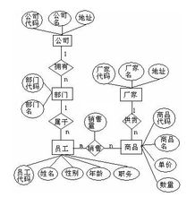

# 关系型数据库

## 数据模型

数据模型
: 对现实世界中某个对象特征的模拟和抽象 `数据模型`{.idx}

### 数据模型的基本要求

1. 真实地模拟现实世界
1. 容易被人理解
1. 便于在计算机上实现

### 数据模型的三个层次

1. 概念模型 `数据模型!概念模型`{.idx}
1. 逻辑模型 `数据模型!逻辑模型`{.idx}
1. 物理模型 `数据模型!物理模型`{.idx}

### 数据模型的三个组成要素

1. 数据结构
1. 数据操作
1. 完整性约束条件

## 概念模型

`数据模型!概念模型`{.idx}

概念模型
: 也称信息模型, 是**按用户的观点对数据和信息建模**, 独立语计算机系统的模型

    概念模型具有较强的语义表达能力, 能够方便, 直接地表达应用所涉及到的现实世界中的各种语义知识, 另一方面它概念简单, 清晰, 易于用户理解, 且不依赖于具体的计算机系统。概念模型主要用于数据库设计, 是用户与数据库设计人员之间进行交流的桥梁

### 基本概念

1. 实体
1. 属性
1. 码
    1. $\text{主码} \in \{\text{候选码} \subseteq \text{超码}\}$
    1. $\text{主属性} = \{\text{属性} \in \text{候选码}\}$
    1. 全码: 所有属性组是候选码
1. 域
1. 实体型
1. 实体集

### 实体间的联系

1. 一对一
1. 一对多
1. 多对多

### 概念模型的表示方法: ER图

`ER图`{.idx}

#### 绘制步骤

1. 确定实体
2. 确定各实体的属性
3. 确定实体之间的联系
4. 确定各联系的属性

## 逻辑模型

`数据模型!逻辑模型`{.idx}

逻辑模型有层次, 网状, 关系(**最广泛**), 面向对象, 对象关系数据模型5种

### 非关系模型的优缺点

优点: 查询效率高

缺点: 数据结构复杂, 不易理解, 编程也复杂

### 关系模型

`数据模型!逻辑模型!关系模型`{.idx}

数据结构是一张二维表, 其优点是:

1. 有严格的理论基础, 概念单一

    在关系模型中的概念单一主要体现在数据结构单一(即现实世界中实体以及实体之间的各种联系都用关系来表示), 而数据结构单一又带来操作符的统一。操作符的统一体现在无论是插入(或删除修改)一个实体值还是插入(或删除修改)一个联系值, 操作的命令是相同的(不像DBTG中用STORE插入实体值, 用CONNECT插入联系值), 这大大方便了用户的使用

1. 数据结构简单, 清晰, 用户易于理解

    所谓存储路径对用户透明就是指用户不需要知道数据的物理结构和存储方式. 优点: 因为存取路径对用户透明, 从而具有更高的数据独立性, 更好的安全保密性, 简化了程序员的工作. 缺点: 因为存取路径对用户透明, 导致查询效率不如非关系系统, 增加了开发DBMS的难度

1. 存取路径对用户透明, 程序与数据的独立性高, 易于应用程序的编写和维护

缺点:

1. 查询效率不如非关系模型, DBMS的开发难度高

#### 关系模型的数据结构

分量
: 列(不可再分)

元组
: 行

#### 关系模型的完整性

1. 实体完整性: 主码中的属性不能取空值
1. 参照完整性
1. 用户定义完整性

#### 关系操作的分类

最常用的关系操作有:

查询操作
: 选择, 投影，连接, 除法, 并, 交, 差, 广义笛卡儿积

更新操作
: 增加, 删除, 修改

#### 关系操作的特点

1. 关系操作采用集合操作方式
1. 高度的非过程化

## 关系代数

非过程化语言
: 用户只要告诉系统操作的要求, 不必告诉系统如何来完成该操作(即用户只要告诉系统"做什么", 而不必告诉"怎么做")的语言就是非过程化语言

### 传统集合运算符

1. **并** $\cup$
1. **差** $-$
1. 交 $\cap$
1. **广义笛卡儿积** $\times$

并, 差, 广义笛卡儿积都是基本运算

交是非基本运算

### 专门的关系运算符

1. **选择** (`SELECT * WHERE F`{.sql}) $\sigma_F(R)$ (F为判断条件)
1. **投影** (`SELECT A, B, ...`{.sql}) $\pi_{A [, B \ldots]}(R)$
1. 连接 $R \underset{R.A_0 \Theta S.A_1}{\Join} S, \Theta \in \{>, <, =, \ldots\}$

    等值连接: $\Theta \rightarrow =$
    自然连接: 被连接的两个关系中进行相等比较的分量必须是相同的属性(组), 并且要在结果中把重复的属性(组)去掉

1. 除 $R \div S$

选择, 投影是基本运算

连接, 除是得基本运算

### 扩展的关系运算符

1. 外连接 $R \leftouterjoin S$ ($=$在哪边保留哪边元组)
1. 广义投影(`SELECT A, B, F(C), ...`{.sql}) $\pi_{A [, B [, F(C) \ldots]]}(R)$
1. 聚合(`SELECT F1，F2, ... GROUP BY A, B, ...`{.sql}) $_{A, B, \ldots} \mathcal{G} _{F_1, F_2, \ldots} (R)$: 指定若干个属性组成新的关系
