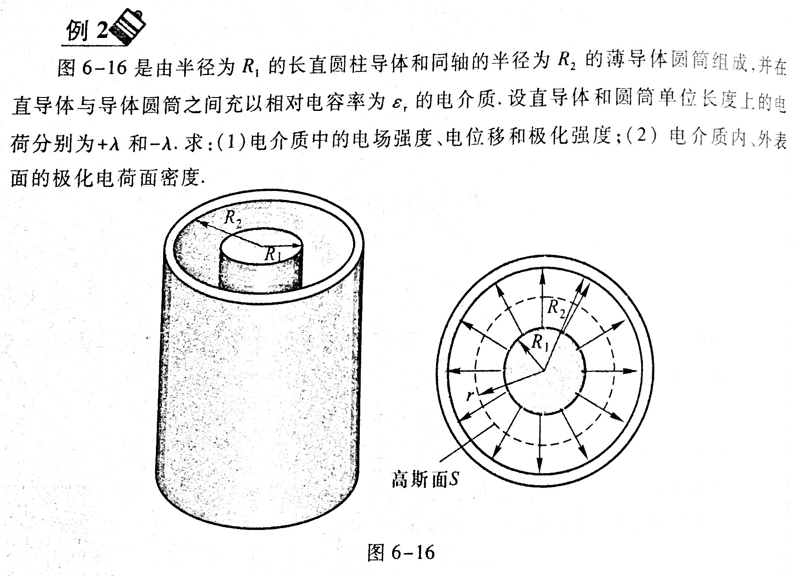

# 静电场中的导体与电介质

## 静电平衡条件

电荷
: 导体内没有电荷作用定向运动

电场强度
: 满足以下两个条件

    * 导体内部任何一点处的电场强度为0
    * 导体表面处电场强度方向都与导体表面垂直

电势
: 导体内任意两点间的电势相等

## 静电平衡时导体上的电荷分布

* 实心导体电荷只分布在导体表面上
* 带空腔的导体电荷只分布在外表面上
* 带电导体表面曲率半径较小处的附近的电场要强一些

## 静电屏蔽

* 空腔导体屏蔽外电场
* 接地空腔导体屏蔽内电场

## 电介质中的高斯定理

极化电荷密度
: $\sigma^{'}$

电极化密度
: $\vec{P} = (\varepsilon_r - 1)\varepsilon_0 \vec{E}$

    两平板间$P = \sigma^{'}$

电位移
: $\vec{D} = \varepsilon_0 \varepsilon_r \vec{E}$

电介质中的高斯定理
: $\oint_S \vec{D} \cdot d\vec{S} = Q_0$

## 电容

孤立导体电容
: $C = \frac{Q}{V}$

电容器(两导体)
: $C = \frac{Q}{U}$

平板电容器
: $C = \frac{\varepsilon_0 \varepsilon_r S}{d}$
