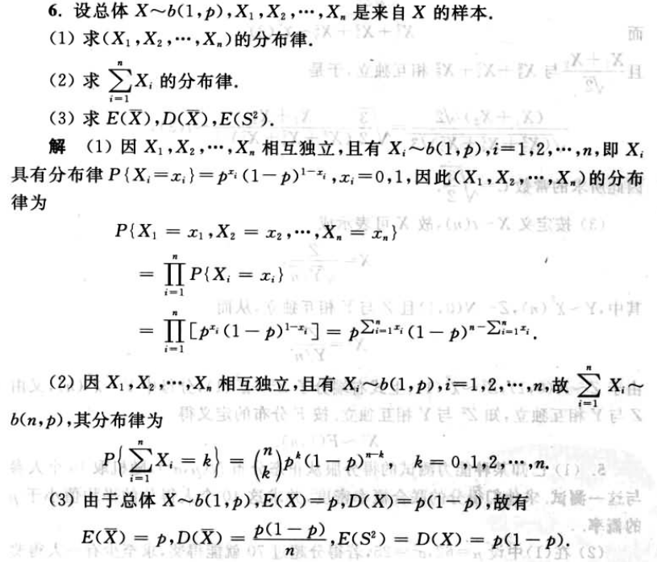

# 样本及抽样分析

样本平均差
: $\bar{X} = \frac{1}{n} \sum_{i = 1}^n X_i$

样本方差
: $S^2 = \frac{1}{n - 1} \sum_{i = 1}^n (X_i - \bar{X})^2$

样本标准差
: $S$

样本$k$阶(原点)矩
: $A_k = \frac{1}{n} \sum_{i = 1}^n X_i^k$

样本$k$阶中心矩
: $B_k = \frac{1}{n} \sum_{i = 1}^n (X_i - \bar{X})^k$

经验分布函数
: $F_n(x)$

$\chi^2$分布: $\chi^2 \sim \chi^2(n)$
: $X_1, X_2, \ldots$是来自总体$N(0, 1)$的样本， 则称统计量$\chi^2 = X_1^2 + X_2^2 + \ldots + X_n^2$, 服从自由度为$n$的$\chi^2$分布

   数学期望
   : $E(\chi^2) = n$

   方差
   : $D(\chi^2) = n^2$

   $\chi^2$分布的可加性
   : $\chi_1^2 + \chi_2^2 \sim \chi^2(n_1 + n_2)$

