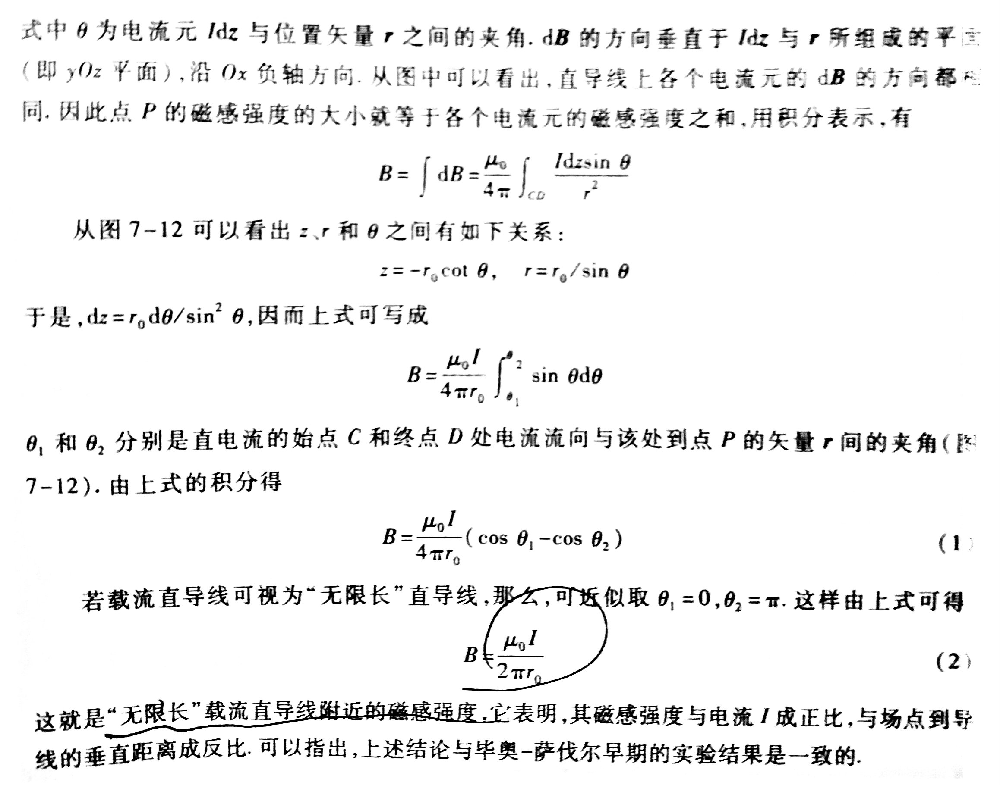
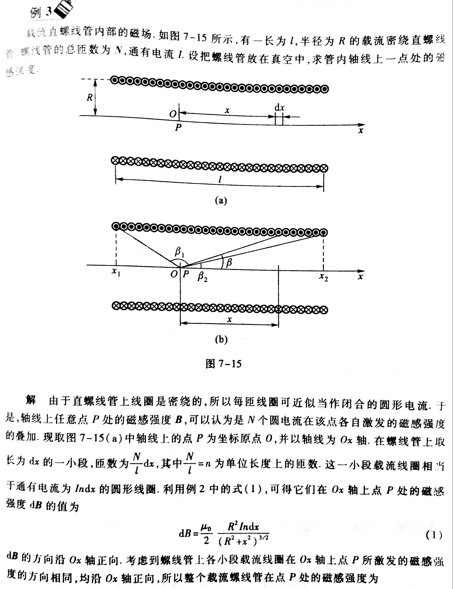

# 恒定磁场

毕奥-萨伐尔定律
: $d\vec{B} = \frac{\mu}{4\pi} \frac{\vec{I}d\vec{l} \times \vec{e_r}}{r^2}$

磁矩
: $\vec{m} = IS\vec{e_n}$

磁通量
: $\vec{\Phi} = \vec{B} \cdot \vec{S}$

## 常见带电物体周围磁场

无限长直导线
: $B = \frac{\mu_0 I}{2\pi r_0}$

    

    

圆环流
: $B = \frac{\mu_0}{2} \frac{R^2 I}{(R^2 + x^2)^{\frac{3}{2}}}$

    

    

无限长螺线管
: $B = \mu_0 n I$

    

    

    
