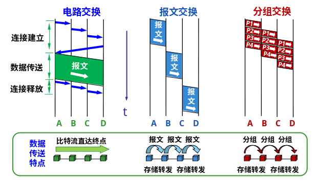
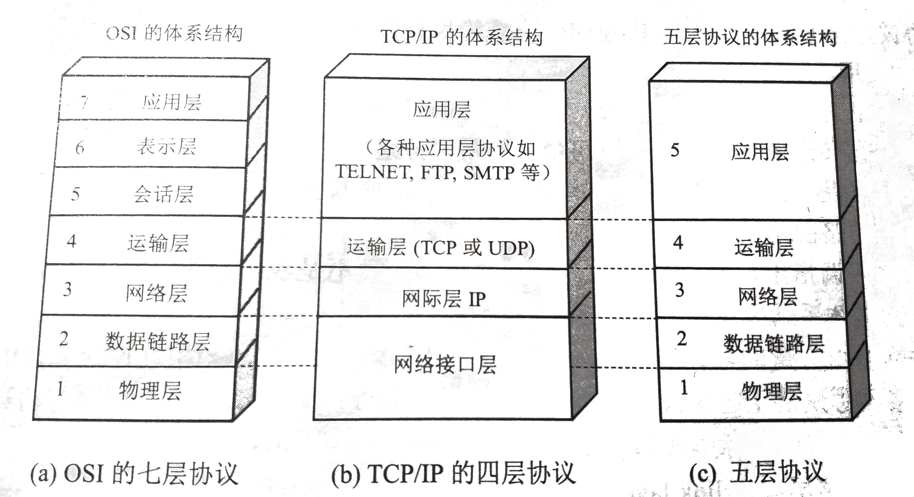

<!--
  vi: ft=pandoc.markdown
-->

# 概述

## 基本概念

三大类网络, 三王融合 `三网融合`{.idx} `电信网络`{.idx} `有线电视网络`{.idx} `计算机网络`{.idx}
: 电信网络, 有线电视网络, 计算机网络

互连网 `互连网`{.idx}
: 网络的网络

互联网(Internet) `互联网`{.idx}
: 采用TCP/IP协议族的特定互连网

互联网向用户提供的基本功能
: 连通性, 共享, 增强可靠性

## 互联网发展的三个阶段

1. 单个网络ARPANET向互连网发展 `ARPANET`{.idx}
1. 三级结构网络: 主干网, 地区网, 校园网(企业网)
1. 多层次ISP结构的互联网 `ISP`{.idx} `IXP`{.idx}

\begin{tikzpicture}
    \node (主干ISP0) at (0,0) {主干ISP};

    \node (主干ISP1-0) at (-2.5,-1) {主干ISP};
    \node (主干ISP1-1) at (2.5,-1) {主干ISP};

    \node (地区ISP2-0) at (-3.5,-2) {地区ISP};
    \node (地区ISP2-1) at (-1.5,-2) {地区ISP};
    \node (地区ISP2-2) at (0.8,-2) {地区ISP};
    \node (IXP2-3) at (2.5,-2) {IXP};
    \node (地区ISP2-4) at (4.2,-2) {地区ISP};

    \node (大公司3-0) at (-4,-3) {大公司};
    \node (本地ISP3-1) at (-2,-3) {本地ISP};

    \node (主机4-0) at (-2,-4) {主机};

    \draw (主干ISP0) -- (主干ISP1-0);
    \draw (主干ISP0) -- (主干ISP1-1);

    \draw (主干ISP1-0) -- (地区ISP2-0);
    \draw (主干ISP1-0) -- (地区ISP2-1);
    \draw (主干ISP1-1) -- (地区ISP2-2);
    \draw (主干ISP1-1) -- (地区ISP2-4);
    \draw (地区ISP2-2) -- (IXP2-3) -- (地区ISP2-4);

    \draw (地区ISP2-0) -- (大公司3-0);
    \draw (地区ISP2-0) -- (本地ISP3-1);
    \draw (本地ISP3-1) -- (主机4-0);
\end{tikzpicture}

## 互联网标准化

? P8

## 互联网的组成

边缘部分, 核心部分 `边缘部分`{.idx} `核心部分`{.idx}

边缘系统通信方式
: C/S(客户-服务器方式), P2P(对等方式) `C/S`{.idx} `P2P`{.idx} `客户-服务器方式`{.idx} `对等方式`{.idx}

核心部分负责连接边缘部分, 连接方式
: 电路交换, 报文交换, 分组交换 `电路交换`{.idx} `报文交换`{.idx} `分组交换`{.idx}

### 电路交换

`电路交换`{.idx}

\noindent
**面向连接** `面向连接`{.idx}

\noindent
建立连接 $\rightarrow$ 通信 $\rightarrow$ 释放连接

优点
: 实时性强, 时延小, 交换成本较低

缺点
: 线路利用低, 电路接续时间长, 通信效率低, 不同类型终端用户之间不能通信等缺点

电路交换比较适用于信息量大, 长报文, 经常使用的固定用户之间的通信

### 报文交换

`报文交换`{.idx}

优点
: 中继电路利用率高, 可以多个用户同时在一条线路上传送, 可实现不同速率, 不同规程的终端间互通

缺点
: 以报文为单位进行存储转发, 网络传输时延大, 且占用大量的交换机内存和外存, 不能满足对实时性要求高的客户

报文交换适用于传输的报文较短, 实时性要求较低的网络用户之间的通信, 如公用电报网

### 分组交换

`分组交换`{.idx}

优点
: 高效, 灵活, 迅速, 可靠

缺点
: 分组在各结点储存转发要排队, 造成延迟. 分组携带首部, 造成开销

分组交换比电路交换的电路利用率高, 比报文交换的传输时延小, 交互性好

## 计算机网络的性能

## 计算机网络的体系结构

网络协议三个要素
: 语法, 语义, 同步

`OSI`{.idx} `TCP/IP`{.idx} `五层协议`{.idx}

