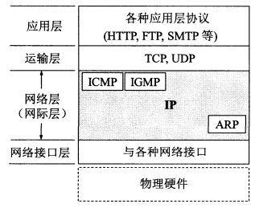
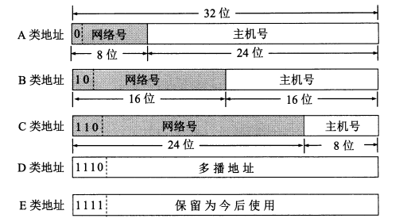
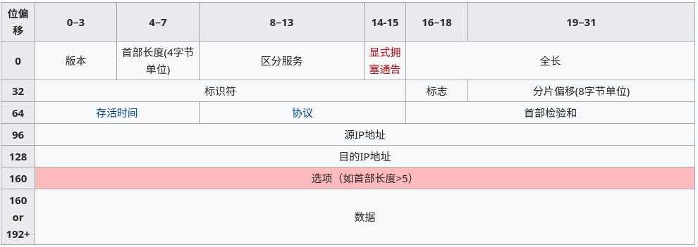

<!--
  vi: ft=pandoc.markdown
-->

# 网络层

功能
: 网络层向上只提供简单灵活的, 无连接的, 尽最大履历交互的数据报服务(分组, IP数据报). 不提供服务质量的承诺

设备
: 路由器, L3-switch

{width=300}

## IP地址分类

{width=450}

类别 | 最大网络数 (全0本网络) | 最大主机数 (全0本主机, 全1所有)
-- | -- | --
A | $2^7 - 2$ 全1(127) | $2^24 - 2$
B | $2^{14} - 1$ | $2^16 - 2$
C | $2^{21} - 1$ | $2^8 - 2$

\noindent
**子网**, **构成超网CIDR**

## IP数据报

标识
: 标识数据报分片重装

全长
: 单位字节, 最大MTU=1500

标志
: MF(还有分片), DF(不能分片)

## 地址解析(ARP)

P124

## 路由(内部网关协议RIP)

P153, 注意+1
