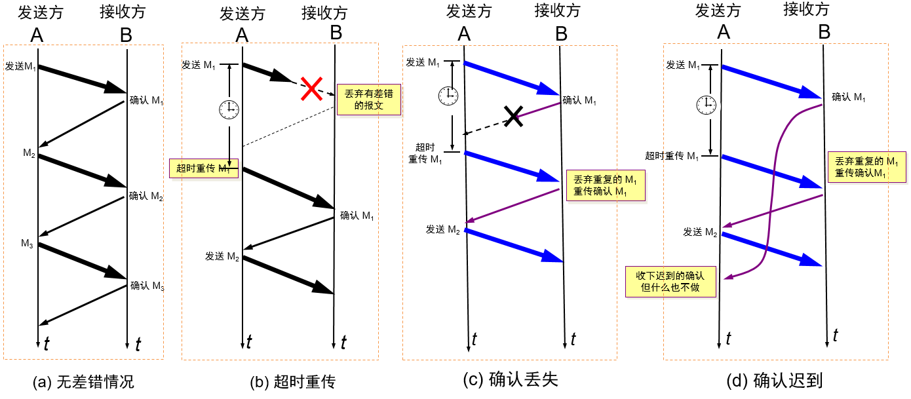
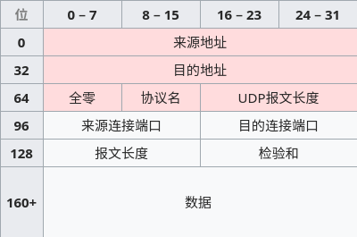
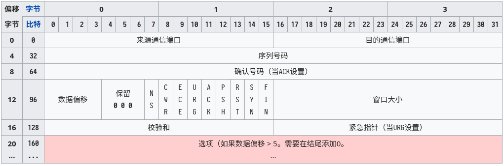

<!--
  vi: ft=pandoc.markdown
-->

# 运输层

运输层为**应用进程提供端到端的通信服务**, 可以提供**面向连接的数据流支持, 可靠性, 流量控制, 融塞避免, 多路复用**服务

## 多路复用(端口)

$0-1023$
: 熟知端口号/系统端口号

$1024-49141$
: 登记端口号

$49152-65535$
: 短暂端口号

应用 | 服务 | 应用 | 服务
:--: | :--: | :--: | :--: |
FTP | 21 | TELNET | 23
SMTP | 25 | DNS | 53
HTTP | 80 | HTTPS | 443

## 可靠性实现

### 停止等待协议

{width=400}

### 连续ARQ协议

* 选择重传
* 累计确认 + 回退N

### 滑动窗口协议

见TCP

## UDP (用户数据包协议)

{width=250}

支持一对一, 一对多, 多对一, 多对多交互通信, **面向报文**

伪首部
: 前12字节

协议名
: $17$

校验和
: 伪首部 + 整个UDP报文, 可选(校验和为0)

校验和计算方式
: 校验和段取0, 按照16位为单位, 二进制反码相加后取反

## TCP (传输控制协议)

{width=550}

**面向连接**, 一对一, 可靠交付, 全双工, 面向字节流

MSS
: 最大分段大小 (不包括TCP头)

序列号
: 按字节编号

确认号
: 期望序列号

数据偏移
: 实际TCP头大小, 以32bit为单位

### 可靠交付

P221 5.6

### 流量控制

P227

rwnd
: 接受窗口

### 拥塞控制

P232 5.8.2

cwnd
: 拥塞窗口

ssthresh
: 慢开始门限

### 连接管理

{width=450}
