<!--
    vi: ft=pandoc.markdown
-->

# 组合逻辑电路

## 分析

1. 列出各级函数表达式
1. 化简
1. 真值表
1. 确定功能

## 设计

1. 明确功能
1. 列出真值表
1. 逻辑表达式

## 竞争-冒险

`竞争`{.idx} `冒险`{.idx}

* $L = (A + B)(\widebar{A} + C)$, $B$, $C$为$0$时
* $L = AC + B\widebar{C}$, $A$, $B$为$1$时

竞争
: $L = A \cdot \widebar{A}$ 或 $L = A + \widebar{A}$ 反向器引起的时差

冒险
: 竞争引起的脉冲干扰

### 解决方法

1. 化简后消去$A \cdot \widebar{A}$项
1. 增加乘积项目: $L = AC + B\widebar{C} = AC + B\widebar{C} + AB$ (书P160)
1. 接入滤波电容
1. 引入选通信号

## 常见组合电路

### 编码器($0100 \rightarrow 11$)

`编码器`{.idx} `优先编码器`{.idx} `CD4532`{.idx}

优先编码器CD4532

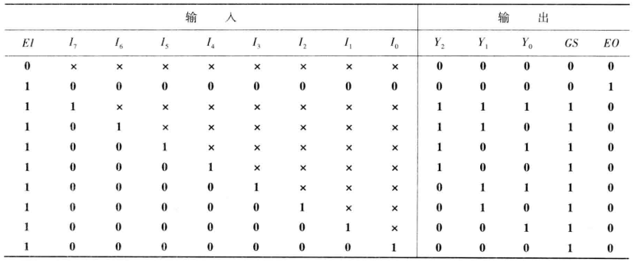{width=400}

CD4532实现16线-4线编码器

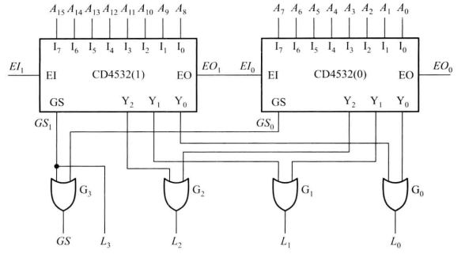{width=400}

### 译码器/数据分配器($11 \rightarrow 0100$)

`译码器`{.idx} `数据分配器`{.idx}

74HC138: `74HC138`{.idx} `74HC139`{.idx}

{width=400}

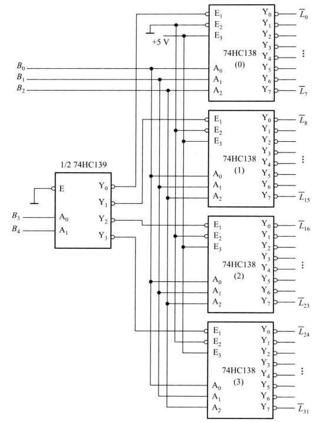{width=380}

74HC4511(7段数码管译码器) (P173) `74HC4511`{.idx}

### 数据分配器

`数据分配器`{.idx}

{width=200}

### 数据选择器

`数据选择器`{.idx}

$Y = \widebar{S}D_0 + SD_1$

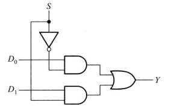{width=150}
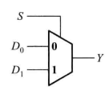{width=100}
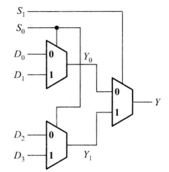{width=150}

74HC151: `74HC151`{.idx}

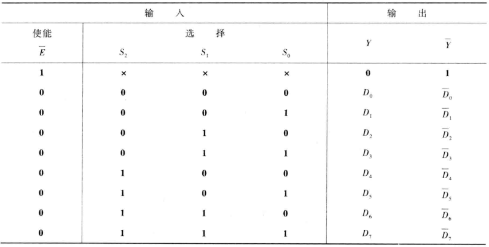{width=400}

位扩展(字长扩展)

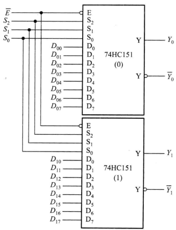{width=200}

字扩展(字数扩展)

{width=250}

`LUT`{.idx}

LUT
: 查找表

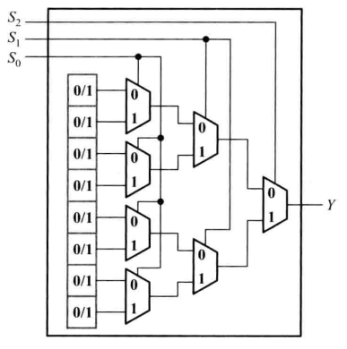{width=250}

### 数值比较器

`数值比较器`{.idx}

(P186)

### 加法器

`加法器`{.idx}

半加器: `半法器`{.idx}

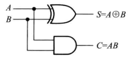{width=100}
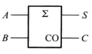{width=100}

全加器: `全加器`{.idx}

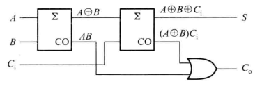{width=200}

并行多位加法器? (P192)

## 组合可编程逻辑器件

PLD `PLD`{.idx}
: Programmable Logic Device 可编程逻辑器件

PLD的分类:

1. PROM 可编程只读储存器 `PROM`{.idx}
1. PLA (Programmable Logic Array) 可编程逻辑阵列 `PLA`{.idx}
1. PAL 可编程阵列逻辑 `PAL`{.idx}

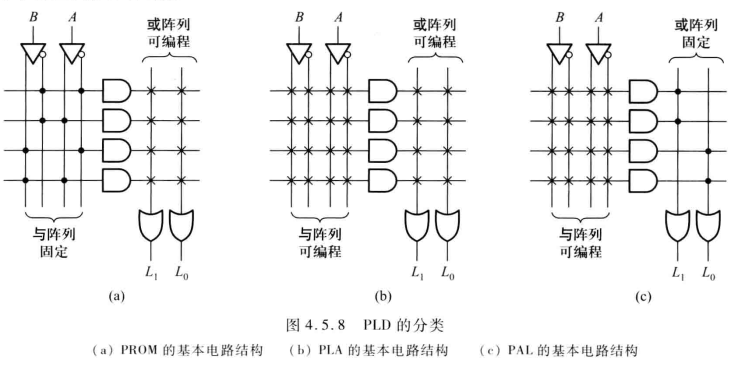{width=400}
