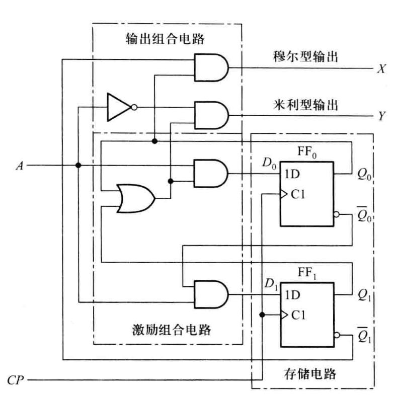
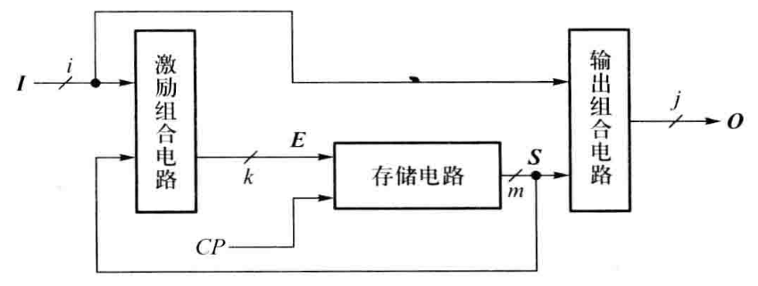
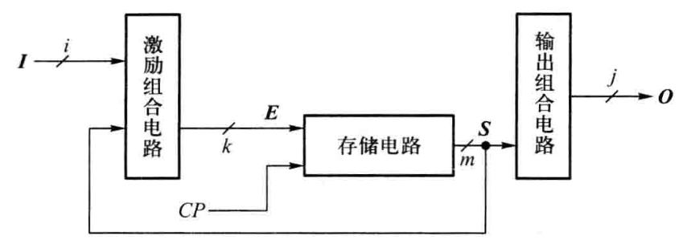
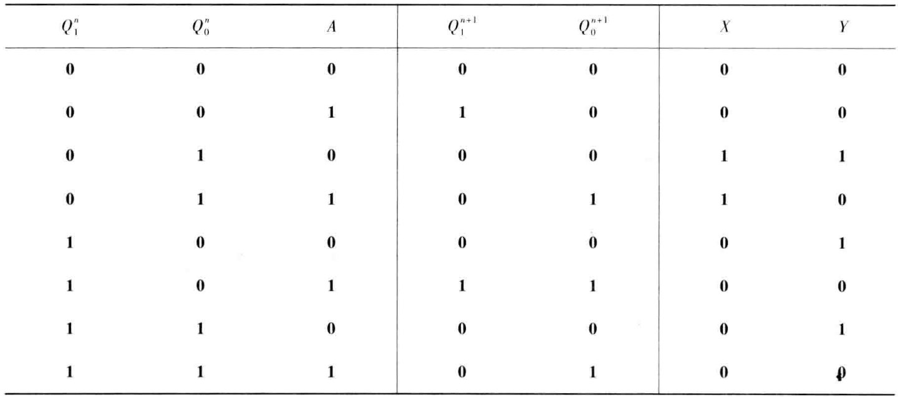
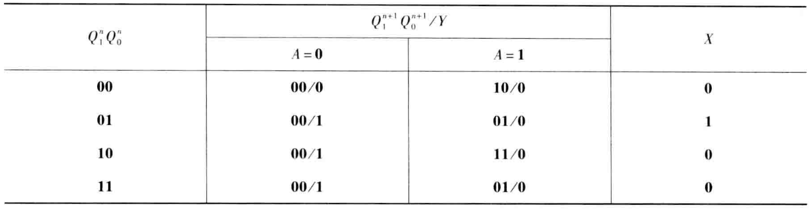
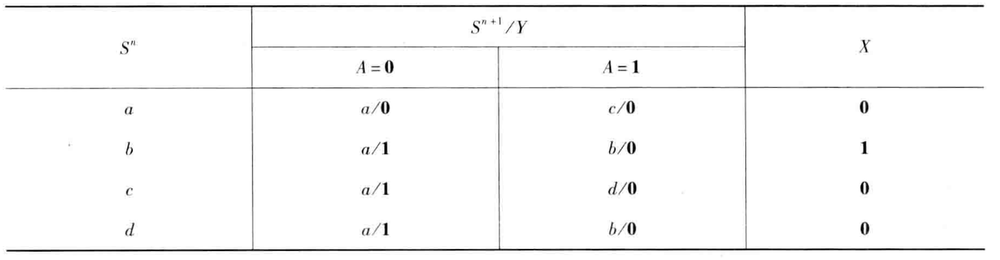
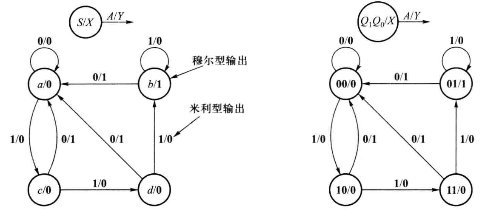
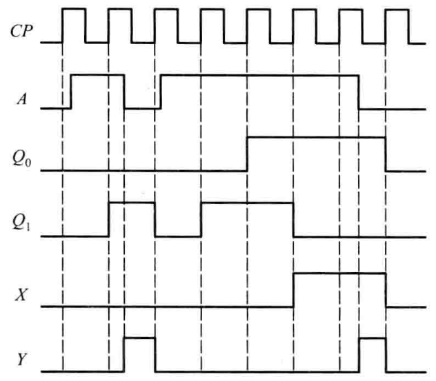

<!--
    vi: ft=pandoc.markdown
-->

# 时序逻辑电路

## 时序电路结构

\centering

{width=300}

\raggedleft

## 时序电路分类

1. 按时钟信号分类

   1. 异步时序电路
   1. 异步时序电路

1. 按输出变量分类

   1. 米利型时序电路

      {width=250}
      
   1. 穆尔型时序电路

     {width=250}

## 时序电路表达

1. 逻辑方程组
   1. **激励方程组**

      $D_0 = (Q_1 + Q_0)A$

      $D_1 = \widebar{Q_0}\widebar{A}$

   1. **转化方程组**

      $Q_0^{n+1} = D_0 = (Q_1^{n} + Q_0)A$
 
      $Q_1^{n+1} = D_1 = \widebar{Q_0}\widebar{A}$
 
   1. **输出方程组**
 
      $X = \widebar{Q_1} Q_0$
 
      $Y = (Q_1 + Q_0) \widebar{A}$

1. **转化表**

   \centering

   {width=400}

   {width=400}

   \raggedright

1. **状态表**

   \centering

   {width=400}

   \raggedright

1. **状态图**

   \centering

   {width=400}

   \raggedright

1. **时序图**

   \centering

   {width=250}

   \raggedright

## 同步时序电路分析
