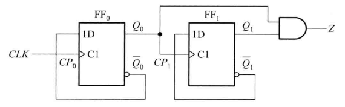
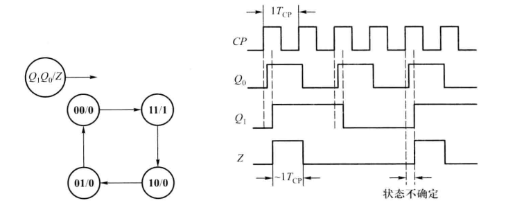
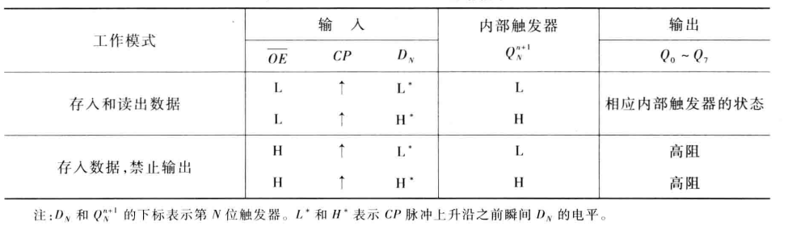
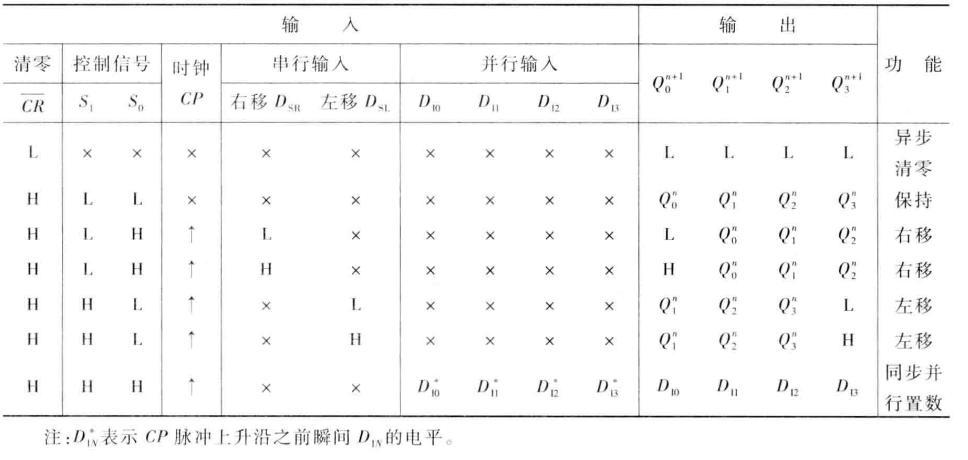
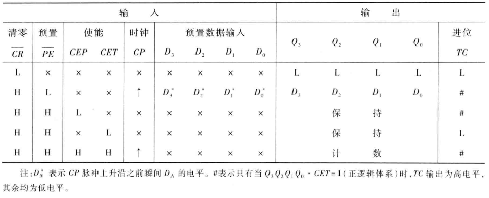

<!--
    vi: ft=pandoc.markdown
-->

# 时序逻辑电路

## 时序电路结构

\centering

{width=300}

\raggedright

`穆尔型输出`{.idx} `米利型输出`{.idx} `输出组合电路`{.idx} `激励组合电路`{.idx}
`储存电路`{.idx}

## 时序电路分类

1. 按时钟信号分类

   1. 同步时序电路 `同步时序电路`{.idx}
   1. 异步时序电路 `异步时序电路`{.idx}

1. 按输出变量分类

   1. 米利型时序电路 `米利型时序电路`{.idx}

      {width=250}
      
   1. 穆尔型时序电路 `穆尔型时序电路`{.idx}

     {width=250}

## 时序电路表达(同步时序电路分析)

`同步时序电路`{.idx}

1. 逻辑方程组 `逻辑方程组`{.idx}

   1. **激励方程组** `激励方程组`{.idx}

      $D_0 = (Q_1 + Q_0)A$

      $D_1 = \widebar{Q_0}\widebar{A}$

   1. **转化方程组** `转化方程组`{.idx}

      $Q_0^{n+1} = D_0 = (Q_1^{n} + Q_0)A$
 
      $Q_1^{n+1} = D_1 = \widebar{Q_0}\widebar{A}$
 
   1. **输出方程组** `输出方程组`{.idx}
 
      $X = \widebar{Q_1} Q_0$
 
      $Y = (Q_1 + Q_0) \widebar{A}$

1. **转化表** `转化表`{.idx}

   \centering

   {width=400}

   {width=400}

   \raggedright

1. **状态表** (分析题中不用) `状态表`{.idx}

   \centering

   {width=400}

   \raggedright

1. **状态图** `状态图`{.idx}

   \centering

   {width=400}

   \raggedright

   有效状态, 无效状态. 无效状态自动进入有效状态, 称具有**自纠正能力**.

1. **时序图** `时序图`{.idx}

   \centering

   {width=250}

   \raggedright

## 同步时序电路设计

`同步时序电路`{.idx}

*@see* P294 例6.3.2 例6.3.3

1. 根据逻辑功能建立原始状态图和原始状态表
1. 状态化简
1. 状态分配
1. 选择触发器类型
1. 确定激励方程组和输出方程组 (直接使用激励表或化简转化方程组凑特性方程)
1. 画出逻辑图并**检查自矫正能力**

## 异步时序电路分析

`异步时序电路`{.idx}

\centering

{width=400}

\raggedright

1. 逻辑方程组 `逻辑方程组`{.idx}

   1. 时钟信号方程组 `时钟信号方程组`{.idx}

      $CP_0 = CLK$

      $CP_1 = Q_0$ 上升沿触发

   1. 激励方程组 `激励方程组`{.idx}

      $D_0 = \widebar{Q_0}$
      
      $D_1 = \widebar{Q_1}$

   1. 转化方程组 `转化方程组`{.idx}

      $Q_0^{n+1} = D_0^n$

      $Q_1^{n+1} = D_1^n$

   1. 输出方程组 `输出方程组`{.idx}

      $Z = Q_1Q_0$

1. 列出转化表 `转化表`{.idx}

   $Q_1^n$ | $Q_0^n$ | $CP_1$ (3) | $CP_0$ (1) | $Q_1^{n + 1}$ (4) | $Q_0^{n + 1}$ (2) | $Z$
   :-----: | :-----: | :----: | :----: | :-----------: | :-----------: | :--:
   0 | 0 | $\uparrow$ | $\uparrow$ | 1 | 1 | 0
   0 | 1 | - | $\uparrow$ | 0 | 0 | 0
   1 | 0 | $\uparrow$ | $\uparrow$ | 0 | 1 | 0
   1 | 1 | - | $\uparrow$ | 1 | 0 | 1

1. 画出状态图和时序图 `状态图`{.idx} `时序图`{.idx}

   \centering

   

   \raggedright

1. 逻辑功能分析

   异步二进制递减计数器

## 常见时序电路

### 序列信号检测器

`序列信号检测器`{.idx}

### 脉冲分配器, 节拍脉冲产生器

`脉冲分配器`{.idx} `节拍脉冲产生器`{.idx}

### 寄存器

`寄存器`{.idx} `74HC374`{.idx}

74HC374:

{width=400}

### 移位寄存器

`移位寄存器`{.idx} `74HC194`{.idx}

74HC194:

{width=400}

### 计数器

`计数器`{.idx} `74LVC161`{.idx}

74LVC161 (同步计数器):

{width=400}

使用74LVC161构成模9的方法:

1. 反馈清零法: $Q == 8$接CR清零
1. 反馈置数法: $Q == 8$接PE置数$0$, $Q == 15, TC == 1$接PE置$7$

### 环形计数器

## 时序可编程逻辑器件

`时序可编程逻辑器件`{.idx} `SPLD`{.idx}

SPLD
: 时序可编程逻辑器件

1. GAL: 通用数组逻辑 (简单, 低密度)
1. CPLD: 复杂型PLD
1. FPGA: 现场可编程逻辑门阵列
