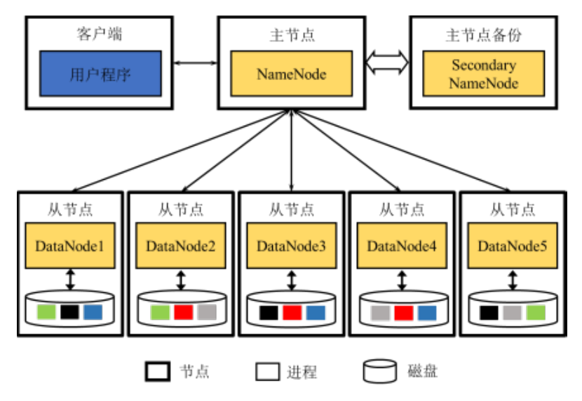
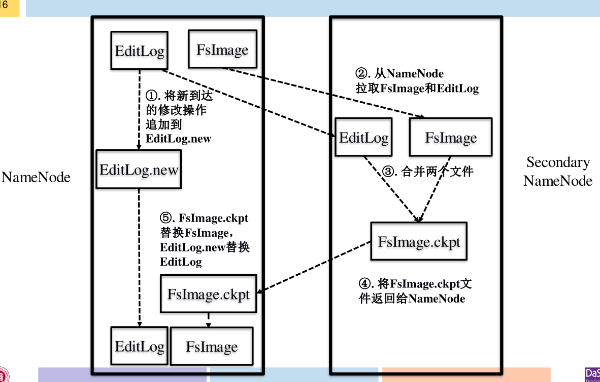

# HDFS

## 体系架构

{width=400pt}

* NameNode: 元数据管理(文件目录结构、位置), 维护DataNode
  * SecondaryNameNode: 一旦NameNode发生故障时利用SecondaryNameNode进行恢复
* DataNode: 负责数据块的存储, 为客户端提供实际文件数据
  * Client直连DataNode

## 工作原理

* 当客户端读取数据时，从NameNode获得数据块不不同副本的存放位置列列表
* Write One Read Many: 一次写入多次读取 (只读文件系统, 避免读写冲突)

### 备份机制

{width=400pt}

* FsImage：内存在⽂文件⽬目录结构及其元信息在磁盘上的快照
* EditLog：两次快照之间，针对⽬目录及⽂文件修改的操作

### 文件操作

* NameNode成功后才成功
* DataNode数据标记后延迟**删除**

### 副本存放策略

1. 就近 > 不太满不太忙 (快速写入, 同步)
2. 不同机架 (减少跨机架网络, 异步?)
3. 同机架不同节点 (应对交换机故障?, 异步?)

## 容错机制

### NameNode故障

根据SecondaryNameNode上的FsImage和Editlog进行恢复

### DataNode故障

节点上⾯面的所有数据都会被标记为 “不可读”, 数据块复制到其余节点