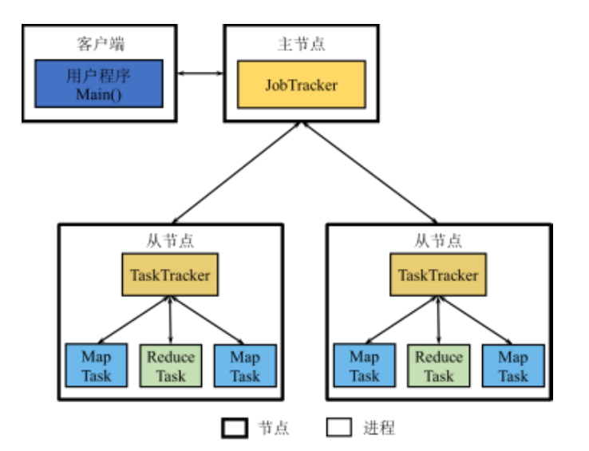
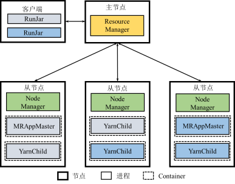
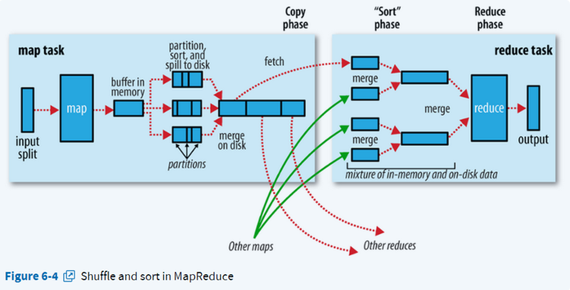

# MapReduce

## 体系架构

{width=300pt}

* JobTracker
  * 资源管理: 通过监控TaskTracker来管理系统拥有的计算资源
  * 作业管理: 负责将作业（Job）拆分成任务（Task），并进行任务调度以及跟踪任务的运行进度、资源使用量等信息
* TaskTracker
  * 管理本节点的资源: TaskTracker使用slot等量划分本节点上的资源量（CPU、内存等）
  * 执行JobTracker的命令: 接收JobTracker发送过来的命令并执行（如启动新Task、杀死Task等）
  * 向JobTracker心跳汇报情况: 通过心跳将本节点上资源使用情况和任务运行进度汇报给JobTracker
* Child -> Task: 任务执行
* Client: 提交作业, 查看运行状态

### MapReduce 2.0 (Yarn)



## 工作原理

* 计算节点向数据靠拢

{width=400pt}

### 输入格式

split: 根据文件格式的切片(text, kv, line...), 可跨block.
一个split一般对应一个map, 即一般决定map数量

### Map

`map: [(k', v')] -> [(k, v)]`

### Shuffle

Shuffle过程是指`map`的结果传入`reduce`的过程

```
shuffle: Mapper -> [(k, v)] -> ordered([(k, v)]) (-> combiner) -> Reducer -> merge
combiner: ordered([(k, v)]) -> ordered([(k, combine(v))])
```

1. map
   1. `[(k', v')]`存入缓冲区
   2. 排序并写入磁盘
      1. spill: 达到缓冲区阈值, 锁定缓冲区, `sort(k')`后写入本地磁盘
      2. spil数达到阈值, 使用combine压缩
      3. merge: 合并有序spill后写入本地磁盘
2. reduce, 根据k=key的offset拉取(copy)数据同时merge, 最后给reduce函数

### Reduce

`reduce: (k', [v']) -> (k', v')`

## 容错机制

* JobTracker故障: 未处理, 重新执行
* TaskTracker故障: JobTracker安排其他TaskTracker
* Task故障
  * Map故障: 重新执行Map
  * Reduce故障: 重新执行Reduce (取哪里重新读入数据?)直至max-try

## 局限性

* 编程框架的表达能⼒有限，⽤用户编程复杂 (Spark)
* 单个作业Shuffle阶段的数据以阻塞⽅方式传输，磁盘IO开销⼤大、延迟⾼高 (Spark)
* 多个作业之间衔接涉及IO开销，应⽤用程序的延迟⾼ (Spark)
* 资源管理与作业高度耦合 (Yarn)
* 作业控制管理高度集中，JobTracker存在单点故障风险，内存开销大 (Yarn)