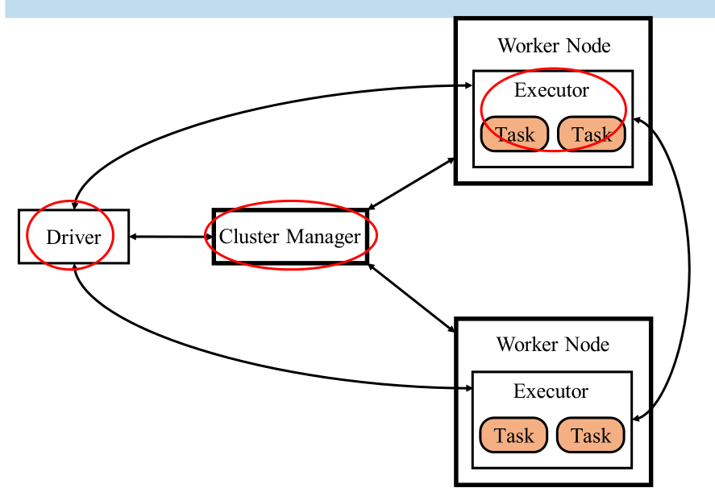
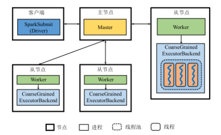
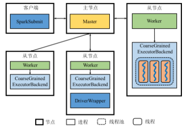
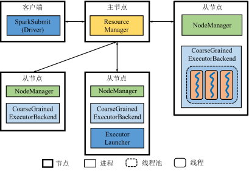
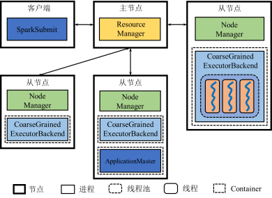
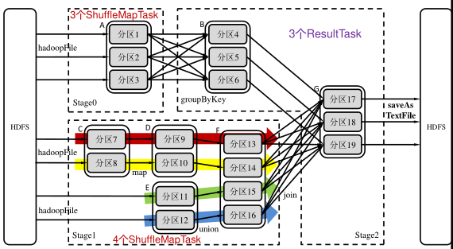
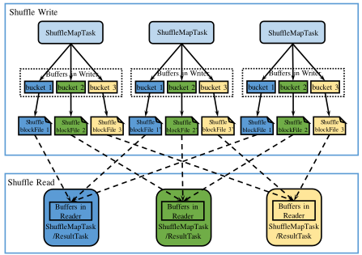

# Spark

Spark解决了MapReduce的局限.

* 数据模型**R**esilient **D**istributed **D**ataset
  * Immutable
  * Resilient (弹性): 容错
  * RDD算子
    * 创建RDD
    * Transformation (转换)
    * Action (操作): 转换结束
* 计算模型DAG (Job)
  * Operator DAG: 节点是算子

    DAG in Apache Spark is a combination of Vertices as well as Edges.
    In DAG vertices represent the RDDs and the edges represent the Operation to
    be applied on RDD.
    Every edge in DAG is directed from earlier to later in a sequence.
    When we call an Action,
    the created DAG is submitted to DAG Scheduler which further splits
    the graph into the stages of the task.

  * RDD Lineage: 节点是RDD

    As we know,
    that whenever a series of transformations are performed on an RDD,
    they are not evaluated immediately, but lazily(Lazy Evaluation).
    When a new RDD has been created from an existing RDD,
    that new RDD contains a pointer to the parent RDD.
    Similarly, all the dependencies between the RDDs will be logged in a graph,
    rather than the actual data. This graph is called the lineage graph.

## 体系架构

{width=300pt}

Spark的架构实现了资源管理(Cluster Manager)和作业管理(Driver)两大功能的分离

* Cluster Manager: 工作节点资源管理
* Driver: 负责启动应用程序的主方法并管理作业运行。
  逻辑上，Driver独立于主节点、从节点以及客户端。
  1. 创建SparkContext
  2. 向CM申请WorkNode
  3. 通知WorkNode启动Executor并确认
  4. 创建DAG(可能有多个) 并持久化 (用于恢复)
  5. 启动Application, 交给Executor执行 (调度Task, 监控Job进度)
* Executor: 负责任务执行, Executor是运行在工作节点上的一个进程，
  它启动若干个线程Task或线程组TaskSet来进行执行任务
* Task: 执行Task的**线程**（MapReduce中的Task是进程）

### Standalone

{width=300pt}

{width=300pt}

* Master+Worker=Cluster manager: 管理Resource的进程，监控Worker资源使用情况，分配资源
* CoarseGrainedExecutorBackend->Task: 管理Task线程

### Yarn

## 工作原理

{width=300pt}

* ShuffleMapStage (TaskSet): 中间结果
* ResultStage (TaskSet): 输出结果

{width=300pt}

## 容错机制

### Master故障

ZooKeeper配置多个Master

## RDD持久化

支持多个缓存级别

* MEMORY_ONLY
* MEMORY_ONLY_SER (序列化)
* MEMORY_ONLY_2 (备份2台机器)
* MEMORY_AND_DISK
* MEMORY_AND_DISK_SER
* MEMORY_AND_DISK_2 (备份2台机器)
* DISK_ONLY

### 故障恢复

Lineage机制: (重新计算丢失分区；重算过程在不同节点之间可以并⾏)
    
执⾏某个partition时，检查⽗RDD对应的partition是否存在:

* 存在: 即可执行当前RDD对应的操作
* 不存在: 窄依赖重构⽗RDD对应的Partition, 宽依赖重构整个⽗亲RDD

### 检查点机制

前述机制不⾜之处:

* Lineage可能⾮常长
* RDD持久化保存到集群内机器磁盘，不完全可靠

检查点机制将RDD写⼊外部可靠的(本身具有容错机制)分布式⽂件系统 (HDFS...)