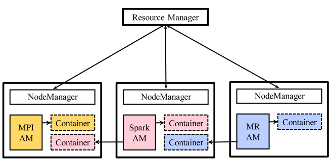
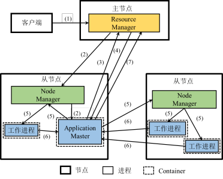

# Yarn

## 体系架构

* ResourceManager: 资源管理器：负责整个系统的资源管理和分配
  * 资源调度器(Resource Scheduler)： 分配Container并进行资源调度
  * 应用程序管理器(Application Manager)：管理整个系统中运行的所有应用
    * 应用程序提交
    * 与调度器协商资源以启动ApplicationMaster
    * 监控ApplicationMaster运行状态
* NodeManager: 节点管理器：负责每个节点资源和任务管理
  * 定时地向RM汇报本节点的资源使用情况和Container运行状态
  * 接受并处理来自AM的Container启动/停止等各种请求
* ApplicationMaster: 当用户基于Yarn平台提交一个框架应用，Yarn均启动一个 AM用于管理该应用
  * AM与RM调度器协商以获取资源（以Container表示），
    将获取的资源进一步分配给作业内部的任务.
    当AM向RM申请资源时， RM向AM返回以Container表示的资源
  * AM与NM通信以启动/停止任务，监控所有任务运行状态，
    并在任务发生故障时重新申请资源来重启任务
* Container: 资源的抽象表示，包含CPU、内存等资源，是一个动态资源划分单位

## 工作原理

{width=300pt}

### 资源分配策略

* FIFO Schedular: 先来先得, 晚来阻塞
* Capacity Schedular: 按照资源占用划分多个FIFO Schedular
* Fair Scheduler: 应用可以独占整个集群, 将空出的资源留给下一个应用

## 容错机制

* Resource Manager故障:
  进⾏故障恢复时需要从某⼀持久化存储系统中恢复状态信息，
  所有应⽤用将会重新执⾏；可以部署多个Resource Manager并通过ZooKeeper进行协调，
  从而保证Resource Manager的⾼可用性
* Node Manager故障:

  * RM认为NM所在节点上所有容器运⾏的任务都执⾏失败， 并把执⾏失败的信息告诉AM；
  * AM将向RM重新申请资源运行这些任务，RM将分配其它节点的Container执⾏这些任务.
  * 如果发⽣故障的NM进行恢复， 那么它将向RM重新注册， 重置本地的状态信息.