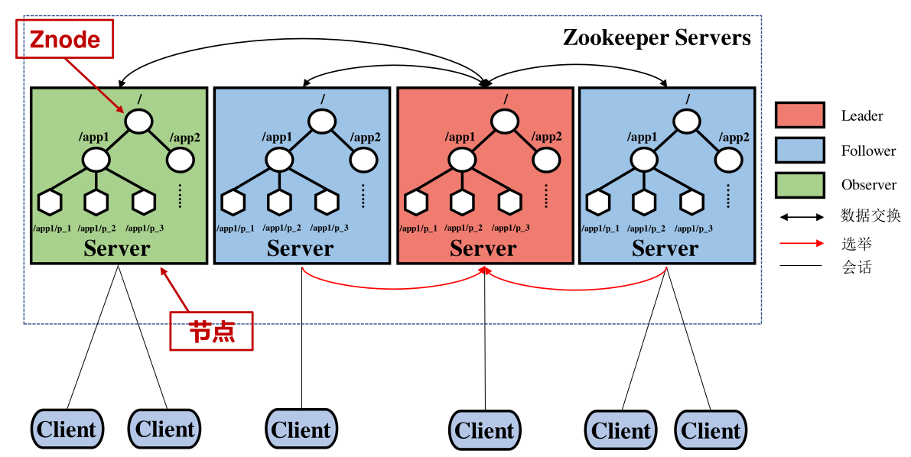

# ZooKeeper

轻量级的分布式存储系统.
并不用于存储大量数据, 而是用于存储元数据或配置信息等.

## 数据模型

类似文件系统的树状结构, 节点称为Znode. Znode的类型有:

* PERSISTENT: 持久Znode
* PERSISTENT_SEQUENTIAL: 持久顺序编号Znode
* EPHEMERAL: 临时Znode, 生命周期是客户端的Session
* EPHEMERAL_SEQUENTIAL: 临时顺序编号Znode

## 体系架构

{width=300pt}

## 工作原理

* 只读服务器转发写请求
* 只读服务器的数据不一定最新, 读请求前应手动先和主节点同步

## 容错机制

* Leader故障: 重新选举
* Follower, Observer: 数据恢复

## 应用

### 命名服务

### 集群管理

* 状态监控: 每个节点创建一个临时Znode, 监控节点watch
* 选主: 例如`[node_1, node_2, node_3]`, 每个节点watch前一个节点是否存在,
  当前一个节点消失时, 自己成为主节点.

### 配置更新

所有节点watch某个config znode

### 同步控制

双屏障机制:

* 进入屏障时，需要足够多的进程准备好
* 当所有进程执行完任务时，才可离开屏障