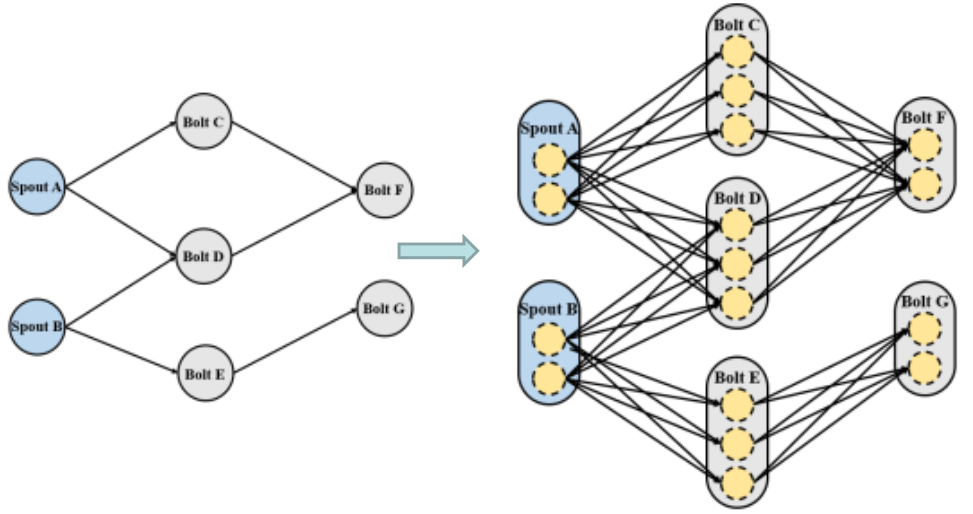
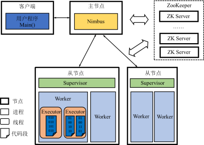

# Storm

流处理系统

## 数据模型

流数据是一个无界的、连续的元组序列.
一个元组就是系统处理的一条记录,
每一条记录（元组）包含若干个字段.

## 计算模型

{width=250pt}

由Spouts和Bolts组成的DAG

* 顶点：Spout或Bolt, 数据处理逻辑. Spout/Bolt物理上由若干个task来实现.
  * Spout：Stream的源头，从外部数据源然后封装成Tuple，发送给Bolt
  * 描述Streams的转换过程，将处理后的Tuple作为新的Streams发送给其他Bolt
* 边：Bolt订阅的流数据, 数据流动的方向

## 体系架构

{width=250pt}

* Nimbus：主节点运行的后台程序，负责分发代码、分配任务和监测故障
* Supervisor：从节点运行的后台程序
  * 负责监听所在机器的工作，
    根据Nimbus分配的任务来决定启动或停止Worker进程
  * 一个从节点上同时运行若干个Worker进程
* Zookeeper：负责Nimbus和Supervisor之间的所有协调工作
  * 若Nimbus进程或Supervisor进程意外终止，
    重启时也能读取、恢复之前的状态并继续工作
* Worker：Worker进程内部运行一个或多个Executor线程，从而实际执行任务
  * Executor：产生于worker进程内部的线程，会执行同一个组件的一个或者多个task
  * Task: 执行数据处理的代码实例（spout/bolt）

## 工作原理

### 流数据分组策略

* ShuffleGrouping：随机分组，随机分发Stream中的Tuple，保证每个Bolt的Task接收Tuple数量大致一致
* FieldsGrouping：按照字段分组，保证相同字段的Tuple分配到同一个Task中
* AllGrouping：广播发送，每一个Task都会收到所有的Tuple
* GlobalGrouping：全局分组，所有的Tuple都发送到同一个Task中
* DirectGrouping：直接分组，直接指定由某个Task来执行Tuple的处理

### 元组传递方式

**一次一元组或一次一记录**, 这种立即发送的消息传递机制有利于减少处理的延迟，从而满足实时性需求

## 容错机制

### 流计算系统容错语义

* At Most Once：消息可能会丢失
* At Least Once：消息不会丢失，可能会重复
* Exactly Once：消息不丢失，不重复

### 元组树

元组树: Spout发出的Tuple及其衍生出来的Tuple抽象为一棵树.

STid(Spout-Tuple-id)：Spout中发射Tuple时用户可以为其指定标识.

### Acker

元组树中的元组非常多，并且往往并行地向Acker报告Mid和STid

`<STid, ack_val>映射表`

* 收到Spout发来消息时将相应STid的ack_val初始化为0
* 无论Acker接收到上游组件还是下游组件报告的消息，
  均将其中的Mid与映射表中相应STid的ack_val进行异或（XOR）操作
* 如果Acker在设定的时间范围内收到处于拓扑最末端的Bolt报告并且ack_val为0，
  那么Acker会告诉相应的Spout：STid对应的元组树已经成功地处理完

### 消息重放

Spout重新发送以STid为标识的元组, 
但这种消息重放机制可能会导致消息的重复计算，
达到的是至少一次的容错语义级别