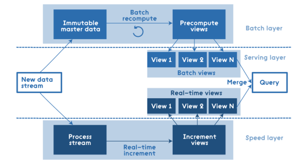
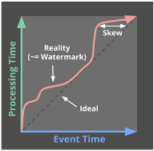

# 批流融合

## Lambda架构

平衡了重新计算高开销和需求低延迟的矛盾

{width=300pt}

* Batch Layer
* Speed Layer: 实施处理新数据, 补偿批处理视图
* Serving Layer (数据库)

缺点:

* 开发复杂：需要将所有的算法实现两次，批处
  理系统和实时系统分开编程，还要求查询得到
  的是两个系统结果的合并
* 运维复杂, 同时维护两套执行引擎

解决方案:

1. 批流系统分开编程变为统一编程: Google Dataflow, Apache Beam
2. 如何将两套执行引擎变为一体化的批流融合执行引擎并支持统一编程:
   Spark Structured Streaming, Apache Flink

## 批处理与流计算的统一性

### 有界 vs. 无界数据集

### 窗口操作

把数据集切分为有限的数据偏以便针对该数据片进行处理

* 滑动窗口: range $>$ slide
* 滚动窗口: range $=$ slide
* 跳跃窗口: range $<$ slide

### 时间域

* 事件时间 Event Time：该事件实际发生的时间
  
  当该事件发生时，其所在系统（可能是传感器等数据源）的当前时间

* 处理时间 Processing Time：一个事件在数据
  处理的过程中被数据处理系统观察到的时间

    当该事件被数据处理系统处理时，数据处理系统的当前时间

* 一个记录的事件时间是永远不变的，
  但是处理时间随着该记录在系统中被各个节点处理时而持续变化
* 水位线 (watermark): 水位线是由系统根据预定义或用户指定的启发式规则生成的,
  因此“认定”实际上只是一种猜测

{width=150pt}

## Dataflow统一编程模型

### 操作描述 (What)

* ParDo: 该操作对每个键值对都执行相同的处理，获得0或多个输出键值对
* GroupByKey: 用来按键把元素重新分组

### 窗口定义 (Where)

例如事件时间窗口

### 触发器 (When)

在某一**处理时间**决定处理窗口的聚合结果并输出, 如果水位线过慢可以提前触发

### 乱序修正 (How)

水位线过快, 数据迟到.  如何管理当前的窗口内容?

* 抛弃(Discarding)：触发器一旦触发后，窗口内容即被抛弃，
  之后窗口计算的结果和之前的结果不存在任何相关性
* 累积(Accumulating)：触发器触发后，窗口内容进行持久化，
  而新得到的结果成为对已输出结果的一个修正版本
* 累积和撤回（Accumulating & Retracting）：触发器触发后，不仅将窗口内容持久化，
  还需记录已经输出的结果。当窗口将来再触发时，
  先撤回已输出的结果，然后输出新得到的结果

## 一体化执行引擎

* 以批处理为核心 (秒级延迟): 将无界数据集划分为小批量数据，
  不断地启动短作业来处理这些小批量数据. 先启动的作业必须执行完，才启动新作业.
* 以流计算为核心 (毫秒级延迟): 启动一个长期运行的作业.
  对于有界数据集来说，相当于系统接收一定量的记录之后就不再接收新的记录了