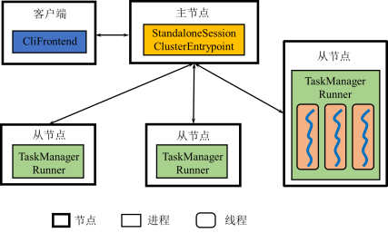

# Flink

## 数据模型

* DataStream: 不间断的、无界的连续记录序列

### DataStream操作算子

一系列的变换操作构成一张有向无环图，即描述计算过程的DAG

* 数据源（DataSource）
* 转换（Transformation）
* 数据池（DataSink）

### 计算模型

Flink系统中的一个应用对应一个DAG. Flink中使用迭代算子实现迭代. 
但流计算中的迭代会把每一次迭代结果继续传播, 与批处理中语义不同.

在流式迭代计算中，通常每一轮迭代计算的部分结果作为输出向后传递，
而另一部分结果作为下一轮迭代计算的输入，
并且迭代过程会一直进行下去.

在批式迭代计算中，每一轮迭代计算的全部结果通常都是下一轮迭代计算的输入，
直到迭代过程在满足收敛条件时停止迭代.

## 体系架构

{width=200pt}

* Client: 将用户编写的DataStream程序翻译为逻辑执行图并进行优化，
  并将优化后的逻辑执行图提交到JobManager
* JobManager：作业管理器.
  根据逻辑执行图产生物理执行图，负责协调系统的作业执行，
  包括任务调度，协调检查点和故障恢复等.
* TaskManager：任务管理器.
  用来执行JobManager分配的任务，
  并且负责读取数据、缓存数据以及与其它TaskManager进行数据传输.

客户端可选Attached/Detached.

### Standalone

{width=250pt}

### Yarn

{width=250pt}

## 工作原理

### 逻辑执行图优化

Chaining: 合并窄依赖的算子

### 物理执行图

根据任务槽(TaskSlot)的容量，
尽可能将存在数据传输关系的算子实例放在同一个任务槽，
保持数据传输的本地性

### 非迭代任务间的数据传输

Pipeline:
上游的Task将数据存在buffer中，一旦buffer满了或者超时，就向下游Task发送
(非阻塞, 也因此不存在Lineage)

### 迭代任务内部的数据传输

* 迭代前端（Iteration Source）和迭代末端（Iteration Sink）两类特殊的任务
* 两类任务成对处于同一个TaskManager，迭代末端任务的输出可以再次作为迭代前端任务的输入

## 容错机制

### JobManager故障

重新启动或JobManager高可用化

### TaskManager故障

#### 状态管理

利用系统题库的系统定义的特殊的数据结构
(状态, `ValueState<T>`, `ListState<T>`, `ReducingState<T>`)
保存有状态算子的状态(计算结果).

* 算子级别的容错

  运行时保存其状态，在发生故障时重置状态，
  并继续处理结果尚未保存到状态当中的记录

* DAG级别的容错

  如果我们可以在“同一时刻”将所有算子的状态保存起来形成检查点，
  一旦出现故障则所有算子都根据检查点重置状态，
  并处理尚未保存到检查点中的记录.
  要求所有节点的物理时钟绝对同步, 但不可能.

#### 非迭代Task

* 在某一时刻，流计算系统所处理的记录可以分为三种类型

  * 已经处理完毕的记录，即所有算子都已经处理了这些记录
  * 正在处理的记录，即部分算子处理了这些记录
  * 尚未处理的记录，即没有算子处理过这些记录

* 虽然绝对同步的时钟是不存在的，
  但是同一时刻保存所有算子状态到检查点的目的是**区分第一种记录与后两种记录**

**异步屏障快照**: Chandy-Lamport算法, 异步屏障快照 (数据流中插入屏障, 每个算子屏障对齐时保存快照)

当发生故障时,
Flink选择最近完整的检查点n，
将系统中每个算子的状态重置为检查点中保存的状态.
然后从数据源重新读取属于屏障n之后的记录 (这要求数据源具备一定的记忆功能).
能够满足**exactly once**的容错语义

#### 迭代Task

仅有屏障是无法区分的, 根据Chandy-Lamport算法,
反馈环路中的所有记录需要以日志形式保存起来.