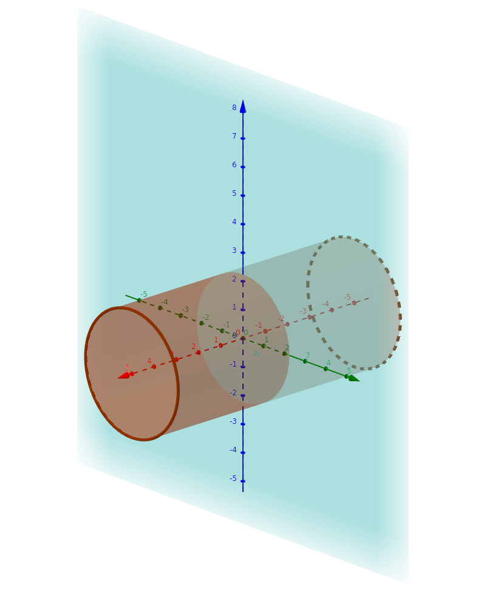

# 静电场

## 常数与单位

* $\mathit{e} = 1.602 \times 10^{-19} C$
* $\varepsilon_{0} = 8.85 \times 10^{-12} C^2 \cdot N^{-1} \cdot m^{-2}$
* $1eV = 1.602 * 10^{-19} J$

## 概念

### 电场强度 $E = \frac{F}{q_0}$

*点电荷电场强度* $F = \frac{1}{4 \pi \varepsilon _{0}} \frac{Q}{r^2} \vec{e_r}$

#### 电场强度通量 $\Phi_e = \oint_s \vec{E} \cdot d \vec{S}$

### 电势能

$$ E_{pA} = q_0 \int_{AB} \vec{E} \cdot d \vec{l}\ (E_{pB} = 0) $$

#### 点电荷电场的电势 \label{点电荷电场的电势}

$$ V = \int_A^\infty \frac{q}{4\pi\varepsilon_0 r^2} dr = \frac{q}{4\pi\varepsilon_0 r} $$

## 定理

### 库伦定理 $F = \frac{1}{4 \pi \varepsilon_{0}} \frac{q_1q_2}{r^2} \vec{e_r}$
\begin{tikzpicture}
    \fill (0, 0) circle[radius=2pt];
    \draw[->] (0, 0) node[above left] {$q_1$} -- (1, 1) node[pos=.7, above left, sloped]{$e_r$} node[right]{$q_2$};
\end{tikzpicture}

### 电场强度叠加

### 高斯定理 $\phi = \oint_{S} E \cdot dS = \frac{q}{\varepsilon _{0}}$

#### 常见带电物体周围电场强度

1. 球面 $E = \begin{cases} 0 & r \leq R \\ \frac{Q}{4 \pi\varepsilon_0 r^2} & r > R\end{cases}$

   ::: {.example}
   半径为R, 均匀带电为Q的球面

   以$r$为半径作一球面$O$,

   **当$r \leq R$时**, $O$内$\sum q = 0$, $E \times 4\pi r^2 = 0$

   **当$r > R$时**, O内$\sum q = Q$, $E \times 4\pi r^2 = \frac{Q}{\varepsilon_0} \Rightarrow E = \frac{Q}{4\pi\varepsilon_0 r^2}$
   :::

1. 无限均匀带电直线$E = \frac{\lambda}{2\pi\varepsilon_0 r}$

   ::: {.example}
   无限长均匀带电直线, 电荷线密度为$\lambda$

   作半径为$r$, 高为$h$的圆柱面 \
   $$E \times 2\pi rh = \frac{\lambda h}{\varepsilon_0} \Rightarrow E = \frac{\lambda}{2\pi\varepsilon_0 r}$$
   :::

1. 无限均匀带电平面$E = \frac{\sigma}{2\varepsilon_0}$

   ::: {.example}
   无限长均匀带电平面, 电荷面密度为$\sigma$

   如图作圆柱体 \
   {width=50%}

   (前后两个圆面)电场强度通量为$E \times 2 \pi r^2$，
   所包含的电量$\sigma \times \pi r^2$

   可得$E = \frac{\sigma}{2\varepsilon_0}$
   :::

### 静电场的环路定理

$$ W = \oint_l q_0 \vec{E} \cdot d \vec{l} = 0 $$

### 电势叠加原理

根据\nameref{点电荷电场的电势},

$$ V_A = \sum_{i = 1}^{n} \frac{q_i}{4\pi\varepsilon_0 r_i} = \frac{1}{4\pi\varepsilon_0} \int \frac{dq}{r} $$
