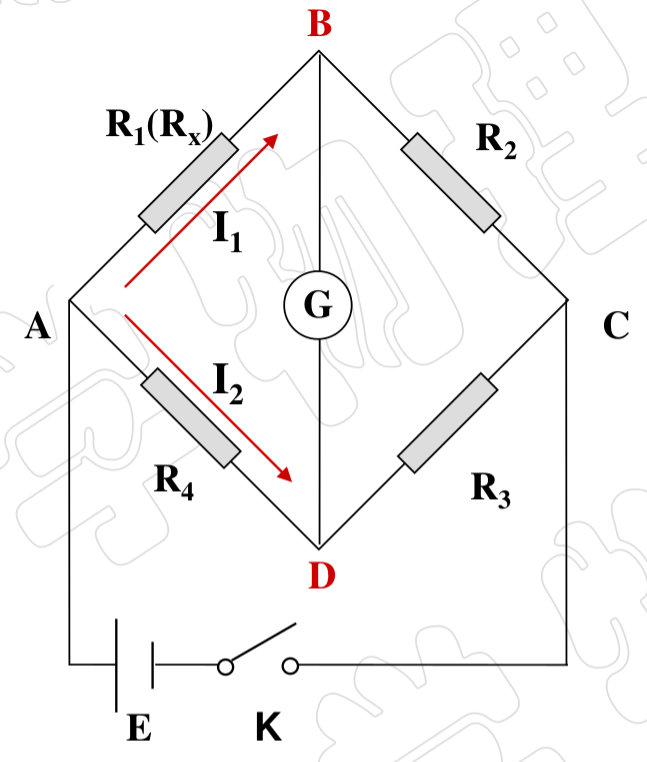
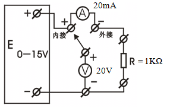
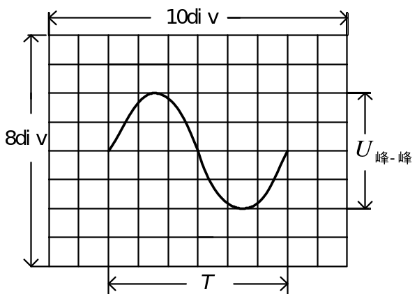
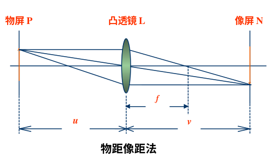
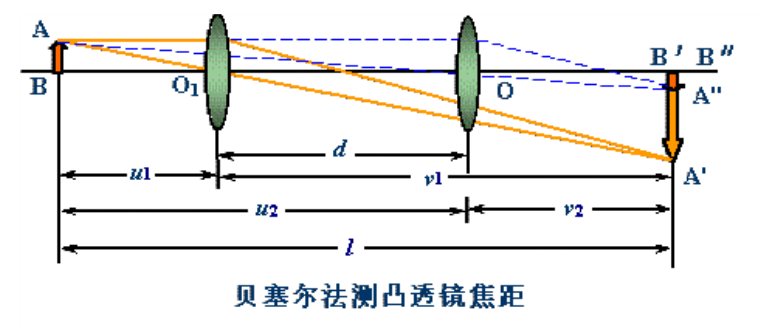

# 利用单摆测重力加速度

## 单摆模型

* 摆线不可延长
* 摆线长远远大于摆球的直径
* 摆球的质量远远大于摆线的质量

## 原理

当单摆拜教很小(小于$10^\circ$)时, 可以假安卓简谐运动, 其固有周期为$T = 2\pi \sqrt{\frac{l}{g}}$, 由公式可得$g = \frac{4 \pi^2 l}{T^2}$

## 问题

* $T^2 - L$关系曲线不通过原点的原因

    * 摆线长度车辆误差
    * 摆角较大
    * 小球体积较大
    * 空气浮力与摩擦阻力

# 温度传感器的特性研究

热敏电阻的分类: 负温度系数(NTC), 临界温度系数(CTR), 正温度系数(PTC)

## 传感器

* NTC热敏电阻温度传感器

    $$R_T = R_0 e^{B(\frac{1}{T} - \frac{1}{T_0})}\ (T < 450^\circ)$$

    $B$为热敏电阻材料系数, 在小温度范围($T < 450^\circ$)内, $B$为常数, $T_0$是室温, $R_0$为$0^\circ C$时的电阻值

* PT100铂温度传感器

    $$R_T = \begin{cases}
    R_0 (1 + AT + BT^2 + CT^3) & -200 ^\circ C < T < 0 ^\circ C \\
    R_0 (1 + AT + BT^2) & 0 ^\circ C < T < 850 ^\circ C \\
    R_0 (1 + A_1 T) & 0 ^\circ C < T < 100 ^\circ C
    \end{cases}$$

    $A = 3.90802 \times 10^{-3}/^\circ C, B = -5.80195 \times 10^{-7}/^\circ C, C = -4.27350 \times 10^{-12}/^\circ C, A_1 = 3.85 \times 10^{-3}/^\circ C$

    $R_0 = 100 \Omega, R_100 = 138.5 \Omega$

* PN结温度传感器

    $$U = Kt + U_{go}$$

    $U$为PN结的正向电压, $t$为摄氏温度, $U_{go}$为半导体材料的参数, $K$为PN结的结电压温度

* 电流型集成温度传感器(AD590)

    $I = Bt + I_0$

## 问题

* 主要误差来源

    安装不当, 绝缘变差, 热惰性, 热阻引起的误差

* NTC热敏电阻的电流应小于$300\mu A$

    温度身高时, NTC电阻值变小, 电流增大, 电流大于$300\mu A$时m 接近电阻的最大耐受功率, 再升高电流m 电阻会烧毁, 影响测量结果. 串联一个电阻解决问题.

# 霍尔效应

## 副效应

* 厄廷豪森效应
* 能斯特效应（热磁效应）
* 里纪-勒杜克效应（热磁效应产生的温差）
* 不等位效应（居首位）

副效应的消除
: $V_H = \dfrac{V_1 - V_2 + V_3 - V_4}{4}$, 厄廷豪森副效应除外

## 作图

* $U_H - I_S$

    $K = \frac{R_H B}{d}$, $U_H = K_H I_S B$, 从而确定霍尔系数$R_H$，载流子浓度$n$, 霍尔灵敏度$K_H$

## 问题

* 当外加磁场与霍尔片不垂直时, 如何获得霍尔电压与$I_S$的关系m 以及霍尔系数等参数

    比实际值偏小, 应计算磁感应强度与霍尔片之间的夹角

# 弹簧振子的研究

## 测量方法

胡克定律: 弹簧在外力作用下将产生形变(即伸长或缩短). 在弹性限度内, 外力F和它的变形量成正比. $F = -ky$

伸长法测弹簧倔强系数
: $mg = -ky \Rightarrow y = \frac{mg}{k} = \frac{g}{k} m$

周期法测弹簧倔强系数
: $F = -kx = ma \Rightarrow T = 2\pi \sqrt{\frac{m}{k}} = 2\pi \sqrt{\frac{m + pm_0}{k}}$

    $p$为待定系数, 柱形弹簧越$\frac{1}{3}$, $pm_0$为有效弹簧质量

## 问题

* 在测量任意弹簧的劲度系数时, 若实砝码盘内砝码的质量呈等差级数列, 而所测得的弹簧的伸长量并非等间隔的变化, 分析出现这种结果的原因.

    弹簧的劲度系数不确定, 砝码长时间使用后质量不标准, 砝码质量超过了弹簧的极限

# 惠斯通电桥测量中值电阻

{width=200px}

电桥平衡时, 当闭合$K$时, $G$中无电流, $U_{AB} = U_{AD}$, $U_{BC} = U_{DC}$, 即$I_1 R_x = I_2 R_4$, $I_1 R_2 = I_2 R_3$, 由此可得

$$R_x = \frac{R_2}{R_3} R_4$$

即$R_x R_3 = R_2 R_4$, 两相对桥臂电阻的乘积相等

## 影响电桥灵敏度的因素

* 与检流计的电流灵敏度$S_i$成正比, 但不是越大越好(不易稳定, 不易调平衡)
* 与电源的电动势$E$成正比
* 与电源的内阻$r_E$和串联的限流电阻$R_E$有关. 增加$R_E$可降低电桥的灵敏度
* 与检流计的内阻$R_G$有关, $R_G$越小越灵敏

# 牛顿环测平面凹透镜曲率半径

光波入射到薄膜, 经薄膜上下表面反射而产生的干涉现象称为薄膜干涉.

## 条纹类型

等倾条纹
: 薄膜厚度均匀时, 光线入射在薄膜上所才产生的的干涉现象, 即同一条纹相应入射光的**同一倾角**.

等厚条纹
: 薄膜厚度不均匀时, 光线入射在薄膜上所才产生的干涉现象, 即同一条纹相应膜的**同一厚度**.

## 牛顿环

$k$级暗环
: $r_k = \sqrt{k \lambda R}$

$k$级明环
: $r_k = \sqrt{\frac{(2k - 1) \lambda R}{2}}$

曲率半径$R$
: $R = \frac{(r_m^2 - r_n^2)}{(m - n) \lambda} = \frac{(D_m^2 - D_n^2)}{4 (m - n) \lambda}$

## 问题

* 膜为何要薄?

    光的相干长度所限

* 若牛顿环中心是亮斑而不是暗斑, 可能是什么原因造成的? 对测量结果有无影响? 

    可能原因时空气间隙层有人尘埃附加光程差. 对结果无影响, 附加光程差是恒定的, 可测量暗环消除误差.

# 非线性元件的伏安特性

{width=250px}

# 用气垫导轨验证动量守恒定律

动量
: $\vec{P} = m\vec{v}$

速度测量
: $v = \frac{\Delta x}{\Delta t_1}$

加速度测量
: $a = \frac{\Delta x^2}{2s}(\frac{1}{\Delta t_2^2} - \frac{1}{\Delta t_1^2})$

恢复系数
: $e = \frac{v_2 - v_1}{v_{10} - v_{20}}$

碰撞
: $\begin{cases}\text{完全弹性碰撞，动量守恒}, e = 1 & \frac{1}{2}m_1v_{10}^2 + \frac{1}{2}m_2v_{20}^2 = \frac{1}{2}m_1v_1^2 + \frac{1}{2}m_2v_2^2 \\ \text{非完全弹性碰撞, 动能损失一部分}, 0 < e < 1 & \frac{1}{2}m_1v_{10}^2 + \frac{1}{2}m_2v_{20}^2 > \frac{1}{2}m_1v_1^2 + \frac{1}{2}m_2v_2^2 \\ \text{完全非弹性碰撞, 动能损失最大}, e = 0 & m_1v_{10} + m_2v_{20} = (m_1 + m_2)v\end{cases}$

## 问题

* 使用气垫导轨要注意哪些问题, 如何调节气垫导轨水平?

    保持气垫导轨表面的平直度和光洁度, 滑块的类表面光洁度, 应严防划伤, 碰坏, 实验过程中不得移动导轨的位置.

    粗调和细调

* 恢复系数$e$可能小于$0$吗? 为什么?

    不可能

* 牛顿第二定律推导出动量守恒定律

    \begin{align*}
    \int_{t_1}^{t_2}F_{12}dt &= m_2v_2 - m_2v_{20} \\
    \int_{t_1}^{t_2}F_{21}dt &= m_1v_1 - m_1v_{10} \\
    \int_{t_1}^{t_2}F_{12} + F_{21}dt &= (m_2v_2 + m_1v_1) - (m_2v_{20} + m_1v_{10}) = 0 \\
    (m_2v_2 + m_1v_1) &= (m_2v_{20} + m_1v_{10})
    \end{align*}

# 扭摆法测定刚体转动惯量

$$T = \frac{2 \pi}{\omega} = 2 \pi \sqrt{\frac{J}{K}}$$

$$K = 4 \pi^2 \frac{J_{\text{载物盘}}}{T_{\text{载物}}^2 - T_{\text{载物盘}^2}}$$

平行轴定理
: 平行轴定理能够很简易地, 从刚体对于一支通过质心的直轴（质心轴）的转动惯量, 计算出刚体对平行于质心轴的另外一支直轴的转动惯量.

    $$J_{Z^\text{'}} = J_Z + ML^2$$

## 问题

* 为何要测量扭转常数

    每个弹簧不一样

# 磁场的描绘

载流圆线圈
:   

亥姆霍兹线圈
: 亥姆霍兹线圈由一对半径与匝数均相同的圆线圈组成, 两线圈置于平行且共轴的位置, 线圈间距正好等于其半径, 坐标原点取在两线圈中心轴连线的中央点处.

# 示波器的原理和使用

## 组成

示波管(CRT), 电子放大系统, 扫描触发系统, 电源

## 读数

$$U_{pp} = Y \times V/div$$

$$T = X \times T/div$$

### 例子

{width=250px}

$2V/div, 0.5ms/div$

\begin{align*}
U_{pp} &= 2 \times 4 = 8v \\
T &= 6 \times 0.5 = 3ms
\end{align*}

## 李萨如图形

{width=250px}

## 问题

* 打开示波器电源后看不到图像的原因

    亮度不够, 扫描线和光点不在显示区

* 李萨如图形抖动原因

    不是整数倍

# 薄透镜焦距的测定

薄透镜成像公式: $\frac{1}{u} + \frac{1}{v} = \frac{1}{f}$

凸透镜成像规律: $\begin{cases}u > 2f & \text{倒立缩小实像} \\ u = 2f & \text{倒立等大实像} \\ f < u < 2f & \text{倒立放大实像} \\ u < f & \text{正立放大虚像}\end{cases}$

## 薄凸透镜焦距的测定方法

自准值法(平面镜法)
: {width=125px}

物距像距法
: {width=125px}

共轭法(贝塞尔法, 二次成像法, 位移法)
: {width=125px}

## 凹透镜焦距的测定

{width=125px}

# 实验

## 测量

直接测量, 间接测量

## 误差

误差是指测量值$x$与被测量的真值$x_0$之差: $\delta = x - x_0$

### 误差分类

* 系统误差
    * 仪器误差
    * 环境误差
    * 实验方法误差
    * 人员误差
* 随机误差

### 误差表现形式

* 绝对误差, $\delta = x - x_0$
* 相对误差, $E = \frac{\delta}{x}$
* 引用误差 = 绝对误差/测量范围上限

### 误差处理

* 系统误差处理
    * 替代法
    * 补偿法
    * 交换法
    * 随机法
* 随机误差处理
    * 随机误差的概率统计
    * 随机误差的特性
    * 算数平均值与标准偏差

        列标准误差
        : $\sigma = \lim_{n \leftarrow \infty} \sqrt{\frac{\sum_{i = 1}^{n} (x_i - x_0)^2}{n}}$

        子样标准差
        : $S = \sqrt{\frac{\sum_{i = 1}^{n} (x_i - \bar{x})^2}{n - 1}}$

        算数平均值标准差
        : $S_{\bar{x}} = \sqrt{\frac{\sum_{i = 1}^{n} (x_i - \bar{x})^2}{n(n - 1)}}$
        
## 不确定度

\begin{align*}
u_A &= S_{\bar{x}} \\
u_B &= \frac{\Delta_{\text{仪}}}{\sqrt{3}} \\
u_C &= \sqrt{u_A^2 + u_B^2}
\end{align*}

## 数据处理

列表法, 作图法, 逐差法, 最小二乘法
