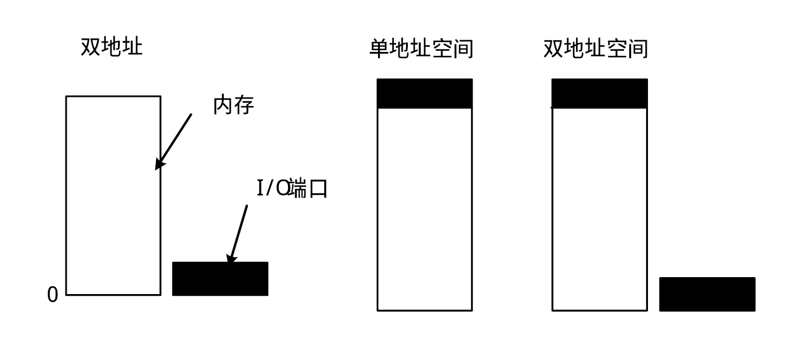
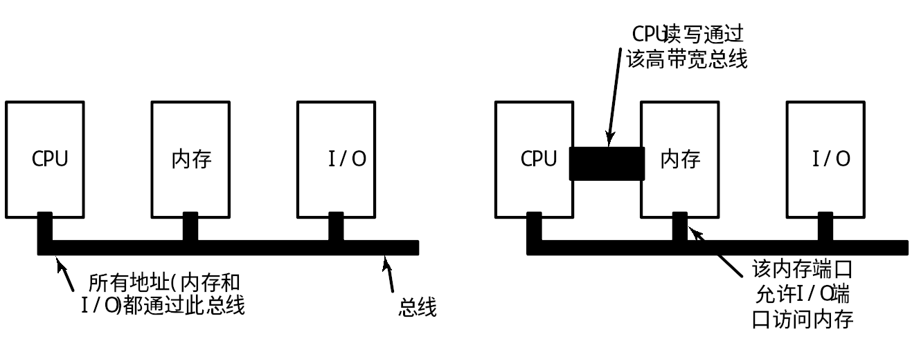
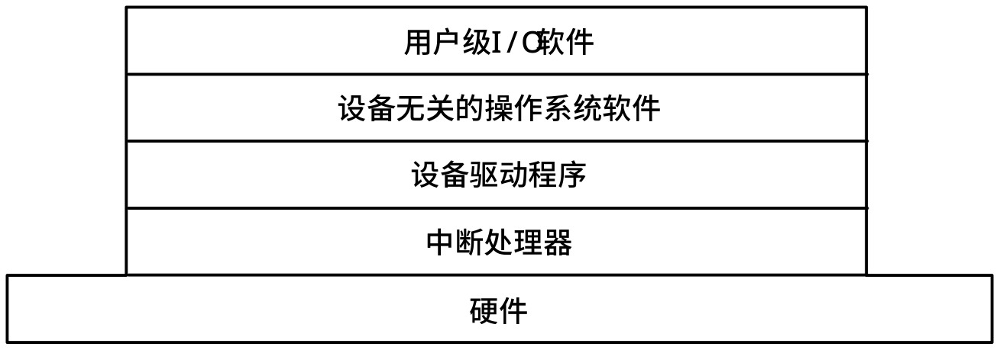

<!--
    vi: ft=pandoc.markdown
-->

# I/O

## 硬件原理

### 设备分类

*使用可共享性分类*

1. 独占设备: 任一指定的时刻**只能让一个进程使用的**设备 (打印机、磁带驱动器等)
1. 共享设备: 能够**同时让许多程序使用**的设备 (磁盘)
1. 虚拟设备: 设备本身是独占设备, 而经过某种技术处理, 可以把它**改造成共享设备**, 同时分配给多个进程. 

*信息组织方式*

1. 块设备: **把信息存储在固定长度的块中**, 每块都有其自己的地址. 一般块的大小在512至32768字节之间. 块设备的基本特征是**每个块都能独立地读写**. 磁盘是最典型的块设备.
1. 字符设备: 字符设备发送或接收一个**字符流,** 不考虑任何块结构. 因此**不编址**, 没有任何**寻址操作**. 打印机、网络接口等是字符设备.

时钟(定时中断)不能按此分类

### 组成部分

1. 机械部分
1. 电子部分(**设备控制器**/**适配器**, USB主控等)

   * 很多控制器可以连接多个相同的设备

### 内存映射

通过内存映射与CPU通讯

* 双地址: 分离内存和I/O端口地址, 独立读写指令(IN OUT)
* 单地址: 控制寄存器映射至内存
* 混合

*优点*

* I/O的设备驱动程序完全可以用C编写
* 使用内存映射I/O, 无需特殊的保护机制来隔离I/O操作和用户进程, (避免这部分内存放入用户进程的虚拟内存)
* 使用内存映射I/O, 每个可以引用内存的指令都同样可以引用控制寄存器

*缺点*

* (对于告诉内存缓存设计) 操作系统必须管理选择性高速缓存
* (单独的高速内存总线) I/O设备无法直接查看内存地址, 需要采取特殊的措施, (连通内存和I/O设备)

  

### DMA

Direct Memory Access, 直接存储器存取, 允许某些计算机内部的硬件子系统(计算机外设), 可以独立地直接读写系统内存, 而不需CPU介入处理 

#### DMA控制器组成

* 一个内存地址寄存器
* 一个字节计数寄存器
* 一个或多个控制寄存器 (指定要使用的I/O端口, 传送方向, 传送单位(一次一个字节或一个字)及一次突发传送中要传送的字节数)

#### 工作流程

**传送前预处理**: 由CPU执行I/O指令, 对DMA控制器进行初始化和启动

1. CPU对DMA控制器编程, 使之知道在哪里传输什么东西. DMA控制器向磁盘控制器发出一个命令, 通知它从磁盘读数据写入其内部缓冲区, 并检查校验和. 当有效数据已经在磁盘控制器的缓冲区内时, DMA就可以开始了

**数据传送阶段**: 由DMA控制器控制(占用)总线进行数据传送

2. DMA控制器通过总线向磁盘控制器发出读请求来启动传输。
3. 写到内存是另一个标准的总线周期
4. 当写操作完成时, 磁盘控制器发送一个确认信号给DMA控制器, 同样也通过总线

**后处理阶段**: 数据传送结束, DMA控制器向CPU发中断请求, 报告DMA操作结束. CPU响应, 转入中断处理程序, 完成结束处理工作

5. 然后DMA控制器使其使用的内存地址加1, 字节计数减1. 如果字节计数仍然大于0, 重复步骤2到4, 直到计数为0. 此时DMA发中断通知CPU传送已完成

#### 占用总线模式

1. (总线一字模式) **周期窃取**(cycle stealing), 因为设备控制器偷偷地潜入, 不定期地从CPU手中偷取总线周期, 稍许延迟CPU操作
1. (总线块模式) **突发模式**(burst mode), DMA控制器告诉设备获取总线, 发出一系列传输, 然后释放总线, 效率更高

## 软件原理

### 程序控制I/O

即忙等待. ~~用户进程控制内存/CPU与外设的信息传递, 它利用CPU发命令启动设备, 并检测等待设备准备好(忙等待), 即CPU控制完成所有的I/O操作~~

简单, 但CPU及所有外设串行工作 (单线程), 适合简单单片机

### 中断驱动I/O

即中断异步流. ~~CPU在I/O操作时, 将进程挂起, 转去做其他工作, 直至I/O完成后, 设备控制器发中断通知CPU, 再唤醒进程~~

*缺点:* 控制器中缓冲区一般较小, 一旦装满就发中断, 造成**中断次数太多**, 中断需要花时间, 浪费相当多的CPU时间. (如打印机, 每个字符输出完毕都产生一个中断)

### DMA

即DMA简化CPU操作. ~~类似于程序控制I/O, 但是用DMA控制器代替CPU来完成所有工作~~

*优点:*

1. 操作均由硬件电路实现, 传输速度快
2. CPU仅在初始化和结束时参与, 基本上不干预数据传送, 可减少CPU开销
3. CPU与外设并行工作, 效率高

*缺点:* DMA控制器的速度不如CPU

## 软件设计

设备无关性, 统一命名, 错误处理, 同步异步, 缓冲, 共享/独占设备占用权限管理

1. 硬件: 实际I/O操作
1. 中断处理程序: 中断唤醒驱动程序
1. 设备驱动程序: 设定设备寄存器, 检查状态
1. 与设备无关的软件: 命名, 保护, 阻塞, 缓冲, 分配
1. 用户进程: I/O调用, 格式化I/O, 假脱机

### 中断处理程序

#### 中断

中断
: ~~在计算机执行期间，系统内发生任何不寻常或非预期的**急需处理**的事件，使得CPU**暂时中断**当前正在运行的程序而**转去**执行相应的事件处理程序，待处理**完毕后又返回**原来被中断处继续执行或调度新的进程。~~

中断源
: ~~引起中断发生的事件~~

中断请求
: ~~中断源向CPU发出的请求中断处理信号~~

中断响应
: ~~CPU收到中断请求后转到相应的事件处理程序的过程~~

关中断/开中断
: CPU内部的PSW的中断允许位被清除/被设置，不允许/允许CPU响应中断。用于保证某段程序执行的原子性

中断屏蔽
: ~~在中断请求产生后，系统有选择地封锁一部分中断而允许另一部分仍能得到响应。有些具有最高优先级的中断不允许被屏蔽。~~

中断应该隐藏在操作系统底处, 隐藏中断的最好方法就是启动**I/O操作的驱动程序阻塞自己**直到I/O完成并产生一个中断。

##### 分类

* 中断源
  * 外中断(中断)
  * 内中断(陷阱)

区别:

* 陷阱通常由正在执行的现行指令引起，而中断则由与现行指令无关的中断源引起。
* 陷阱处理程序提供的服务为当前进程所用，而中断处理程序提供的服务则不为当前进程所用
* CPU在执行完一条指令之后，下一条指令开始之前响应中断，而在一条指令执行中也可以响应陷阱。

#### 处理过程

1. CPU检查响应中断的条件是否满足：有来自于中断源的中断请求、CPU允许中断。
1. 如果CPU响应中断，则CPU关中断，使其进入不可再次响应中断的状态
1. 保存被中断现场。为了在中断处理结束后能正确地返回到断点，必须保存PSW、PC等寄存器的值。
1. 分析中断原因，调用中断处理程序。系统一般都针对不同的中断源编制不同的中断处理子程序(陷阱处理子程序)。这些子程序的入口地址存放在内存的特定单元中。不同的中断源也对应不同的PSW，这些PSW放在相应的内存单元中，与中断处理子程序构成中断向量。系统根据中断向量表找到中断处理子程序的入口和对应的PSW
1. 执行中断处理子程序 
1. 退出中断，恢复被中断进程的现场或调度新进程占用CPU。
1. 开中断，CPU继续执行。

### 设备驱动程序

即硬件的软件接口.

不同设备的寄存器个数和命令含义都不同——设备驱动程序(device driver)是操作系统中唯一知道控制器有几个寄存器及它们用途的程序(每个设备控制器都有一个或多个寄存器用来接受命令或表示设备的状态, 它们通过读写命令按址存取. 通常有数据寄存器, 状态,操作方式寄存器等). 每个驱动程序通常处理一种设备, 或者最多处理一类紧密相关的设备.

分类
: 块设备, 字符设备

#### 任务

接受来自上层的与设备无关软件的抽象请求, 并执行这个请求

1. 检查输入参数是否有效, 如有效, 将抽象请求转换成具体形式, 如磁盘的块号转换成磁道号、柱面号、扇区等
2. 检查设备是否空闲, 如在使用, 则请求排队
3. 根据请求完成的操作, 确定发送哪些命令, 向控制器中的寄存器写入命令, 并检查控制器是否收到命令

#### 特点

1. 与I/O设备的硬件结构密切联系
1. 设备驱动程序中全部是依赖于设备的代码
1. 设备驱动程序是操作系统底层中唯一知道各种输入输出设备的控制器细节
1. 执行确定的缓冲区策略
1. 进行比寄存器接口级别层次更高的一些特殊处理, 如代码转换等

#### 功能

1. 向有关输入输出设备的各种控制器发出控制命令, 并且监督它们的正确执行, 进行必要的错误处理
1. 对各种可能的有关设备排队, 挂起, 唤醒等操作进行处理
1. 执行确定的缓冲区策略
1. 进行比寄存器接口级别层次更高的一些特殊处理, 如代码转换等
1. 发出命令后, 由控制器控制命令的执行, 此时驱动程序

   1. 阻塞自己, 等待控制器完成操作后发中断唤醒
   1. 若操作完成几乎没有延时, 则驱动程序不阻塞

1. 操作完成后, 驱动程序要检查是否有错, 若一切正常, 驱动程序负责将数据送到与设备无关的软件层
1. 向调用者返回一些用于错误报告的状态信息. 若还有其它请求在排队, 则选择一个启动, 否则等待下一个请求

### 与设备无关的I/O软件

实现一般设备都需要的I/O功能, 并向用户层软件提供一个统一的接口

1. 对设备驱动程序统一的接口
1. 缓冲技术
1. 错误报告
1. 分配和释放独占设备
1. 提供与设备无关的数据单位: 字符数量, 块尺寸

#### 对设备驱动程序统一的接口

1. 设备命名: 通过路径名寻址设备
1. 设备保护: 检查用户是否有权访问所申请设备

#### 缓冲

传输速率, 时间约束, 不能直接送达目的地

1. 无缓冲
1. 用户空间缓冲
1. 内核空间单缓冲
1. 内核空间双(轮询)缓冲

*缺点:* 如果数据被缓冲多次, 性能就会遭受损失

#### 错误报告

驱动程序无法处理的错误(小部分), 错误处理的框架(设备无关)

* 编程错误
* 实际的I/O错误类 (例如试图写一个被损坏的磁盘块，或者尝试读取一个关闭的摄像机, 若驱动程序无法处理)

#### 分配和释放独占设备

* 接受/拒绝
* 阻塞队列

#### 与设备无关的块大小

高层只需处理抽象的, 全部使用相同块容量的设备. 隐藏硬件区别

### 用户空间的I/O软件

* 库过程: 统一I/O接口库. ~~系统调用通常由库过程实现, 输入和输出的格式化由库过程完成~~
* 假脱机系统: 将操作内容暂存到独立空间. ~~Spooling是在多道程序系统中处理专用I/O设备的一种方法. 解决方法就是创建一个特殊的进程称为端口监控程序(daemon), 以及一个特殊的目录, 叫做spooling目录(spooling directory). 为了要打印一个文件, 进程首先产生整个要打印的文件, 而且把它放到spooling目录中. 然后由端口监控程序, 它是允许使用打印机的特殊文件的唯一进程, 来打印目录中的文件~~

## I/O实例: 盘

RAID
: 廉价磁盘冗余阵列

柱面斜进量
: 寻道时间内经过的扇区

### 磁盘臂调度算法

1. 先来先服务
2. 最短寻道时间优先
3. 电梯算法

### 可编程时钟