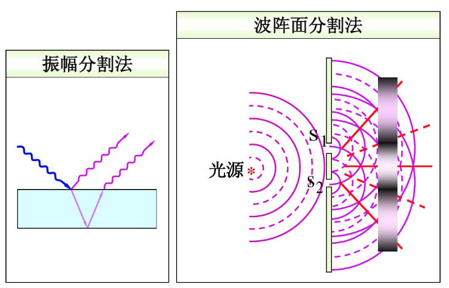
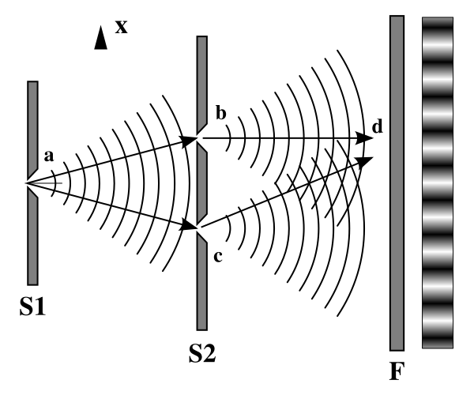
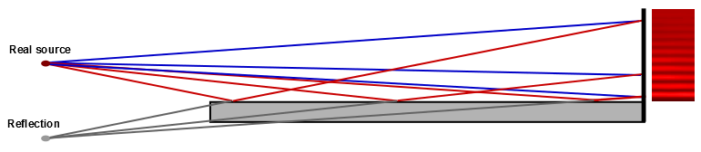
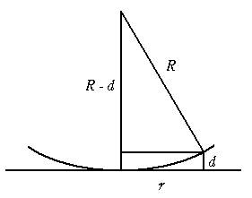
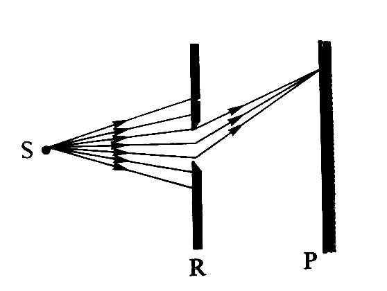
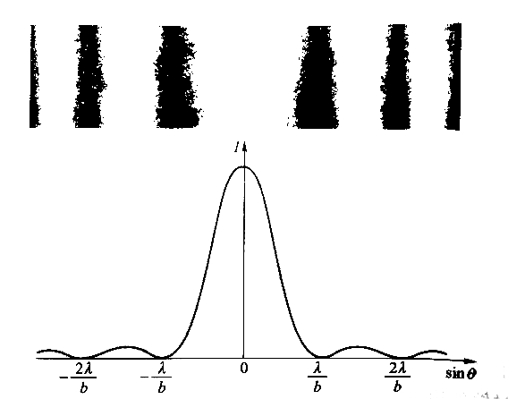
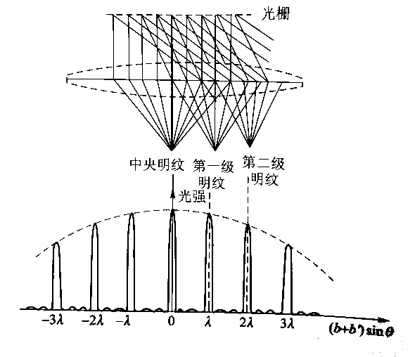

<!--
  vi: ft=pandoc.markdown
-->

# 光学

制造相干波: 振幅分割法, 波阵面分隔法

{width=200}

折射率$n$
: 光从真空中射入其他介质降速程度$\nu = \frac{c}{n}$

光程
: $nL$, $L = k\lambda$

光程差
: $\Delta = \frac{\Delta\varphi}{2\pi} \times \lambda$

半波损失
: 光从**光速大**射向**光速小**时产生的**折射光**损失半个波长, **劳埃德镜**发现

## 干涉

### 杨氏双缝干涉

{width=300}

$d'$ 双缝到屏幕的距离, $d$ 双缝距离, $d' >> d$

明条纹位置
: $x = \pm k \frac{d'}{d} \lambda$

暗条纹位置
: $x = \pm (2k + 1) \frac{d'}{d} \lambda$

### 劳埃德镜

{width=500}

### 薄膜干涉

{width=400}

$AB$距离
: $d\sqrt{n_2^2 - n_1^2 sin^2\ i}$

折射率与角度关系
: $\dfrac{sin\ i}{sin\ r} = \dfrac{n_2}{n_1}$

利用降低反射光增加透射光 (能量守恒)

**注意双倍举例!**

### 劈尖

{width=300}

两条明纹厚度差
: $\frac{\lambda}{2}$

计算条纹数时别忘了第0个(P115例1后一页)

### 牛顿环

{width=300}

(带半波损失)

明环
: $r = \sqrt{(k - \frac{1}{2})R\lambda}, r \in {1, 2, ...}$

暗环
: $r = \sqrt{kR\lambda}, r \in {0, 1, 2, ...}$

## 衍射

波在遇到比尺寸波长大的不多的障碍物时就不遵循直线传播

### 菲涅耳衍射

### 夫琅禾费衍射

$Theta$
: 偏折角度

$b$
: 缝宽

暗纹
: $bsin\ \Theta = \pm 2k \frac{\lambda}{2}, k \in {1, 2, ...}$

明纹
: $bsin\ \Theta = \pm (2k + 1) \frac{\lambda}{2}, k \in {0, 1, 2, ...}$

暗纹间距
: $\Delta x = \frac{\lambda f}{b}$

中央明纹
: $\frac{2\lambda f}{b}$

### 衍射光栅

$b$
: 缝距

$b'$
: 缝宽

明纹
: $sin\ \theta = \frac{k\lambda}{b + b'}$

缺级
: $\frac{b + b'}{b}$级
