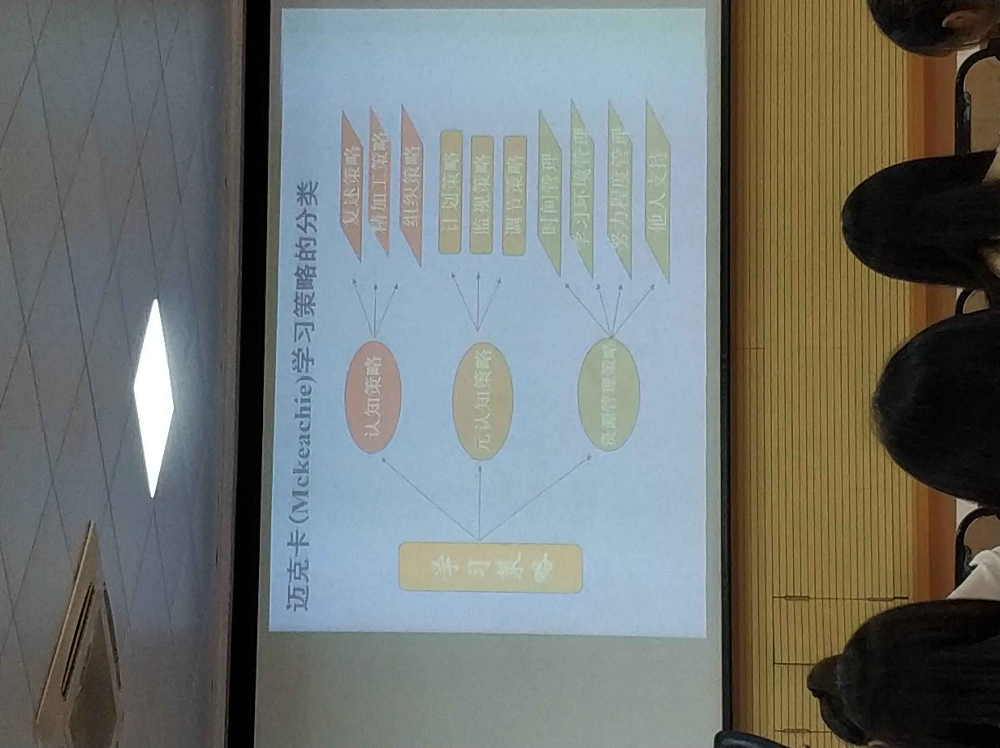

# 认知策略的学习与教学

认知策略定义
： 优化信息加工效果, 提高工作效率的一种认知技能

认知策略 /= 学习策略

## 一些常用的认知策略

### 复述策略

(inc: p106) 即机械记忆的方法

1. 及时复述: 在第一时间复述, (因为遗忘总是先快后慢的)
1. 限时复述: 限定通过复述达到记忆所需的时间, (使大脑技能充分调动)
1. 试图回忆式复述: 尝试背诵和复述相结合, (集中注意未掌握的部分, 发挥自我监控作用)
1. 分散复述: 将复述任务分散到不同的时间内完成
1. 整体与部分相结合的复述: 整体与部分交替复述, (突出重点, 顾及全面)
1. 过度复述: 复述的次数或时间为刚好达到回忆的150%, (高效, 有利于巩固)
1. 多种形式的复述: 多种复述形式, (避免大脑疲劳)
1. 多种感官协同复述: (多通道接受信息, 提高复述效率)

### 精加工策略

将新信息与已有的知识联系起来, 以增强记忆效果, 即在理解基础上的记忆
   
### 操作方式

1. 对意义性不强, 难以归类的材料: 创造出某种联系以赋予一定意义
1. 对意义性材料: 抓住深层含义

### 分类

1. 音字联词
1. ... (inc: p107)